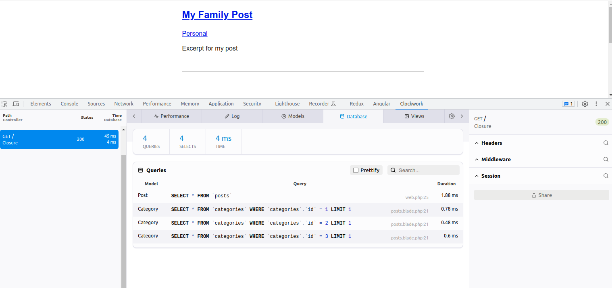
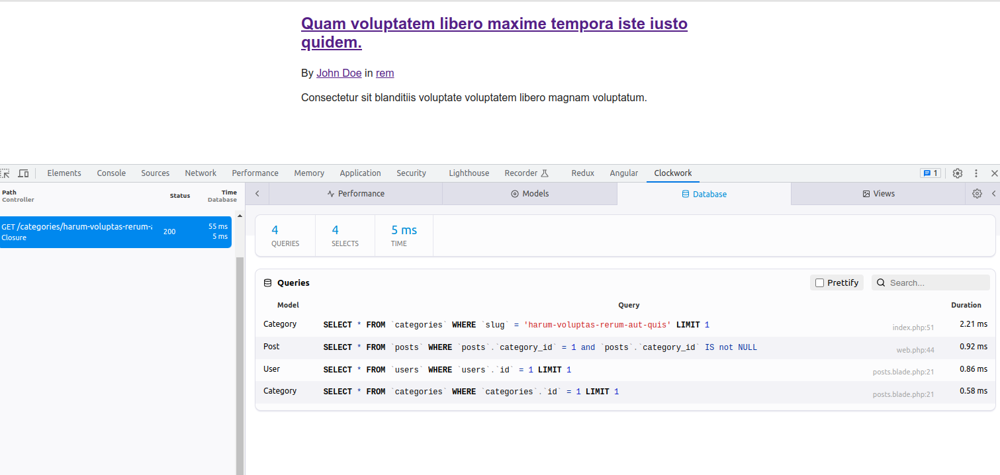

# About

We don't learn tools for the sake of learning tools. Instead, we learn them because they help us accomplish a particular goal. With that in mind, in this series, we'll use the common desire for a blog - with categories, tags, comments, email notifications, and more - as our goal. Laravel will be the tool that helps us get there. Each lesson, geared toward newcomers to Laravel, will provide instructions and techniques that will get you to the finish line.

# 1. Prerequisites and Setup

## 01. An Animated Introduction to MVC

- About

  Before we get started, come along for a quick two minute overview of the MVC architecture. MVC stands for "Model, View, Controller" and is the bedrock for building Laravel applications.

## 02. Initial Environment Setup and Composer

- About

  - I hope you're excited. It's time to dig in. Now, as for prerequisites, you'll need access to a good editor, a terminal, and of course PHP and MySQL. We'll also need to get a tool called [Composer](https://getcomposer.org/) installed on your machine.

- Your First Laravel Project

  - Via the Composer `create-project` command:

    ```bash
    composer create-project laravel/laravel example-app
    ```

  - By globally installing the Laravel installer via Composer:

    ```bash
    composer global require laravel/installer

    laravel new example-app
    ```

    - Note: Be sure to add `bin` directory of composer global directory to the `$PATH`

      - `.bashrc`

        ```bash
        export PATH="$HOME/.config/composer/vendor/bin:$PATH"
        ```

      - Run the `source` command

        ```bash
        source ~/.bash_profile
        ```

  - After the project has been created, start Laravel's local development server using the Laravel's Artisan CLI `serve` command:

    ```bash
    cd example-app

    php artisan serve
    ```

    - Note:

      - To expose the host

        ```bash
        php artisan serve --host=0.0.0.0
        ```

- VS code setup

  - Install `Laravel Blade Snippets`

  - Install `Laravel Blade formatter`

    - settings.json

      ```json
      "bladeFormatter.format.noMultipleEmptyLines": true,
      "[blade]": {
        "editor.defaultFormatter": "shufo.vscode-blade-formatter"
      }
      ```

## 03. The Laravel Installer Tool

- About

  - It's very cool that we can whip up a fresh Laravel application by using `composer create-project`; however, there's an even simpler option that allows you to type laravel new project and, bam, you're up and running. In this episode, let's install it globally on our machine.

  - Extra Credit: Install [Laravel Valet](https://laravel.com/docs/10.x/valet#main-content) to make any new Laravel project accessible via http://app-name.test.

## 04. Why Do We Use Tools

- About

  - We don't learn tools for the sake of learning tools. Instead, we learn tools because they help us accomplish something, or solve a problem that we currently have. As an example, you didn't learn how to use a hammer because you wanted to learn how to use a hammer. No, you learned it because it helped you hang a picture on the wall. The same is true for programming languages and frameworks, like Laravel. With that in mind, our goal is one of the most common goals on the internet: build a functional blog to promote our band, or business, or ideas.

  - Extra Credit: Consider watching the optional [HTML and CSS Workflow](http://laracasts.com/series/html-and-css-workshop) prerequisite series that was mentioned in this video.

# 2. The Basics

## 05. How a Route Loads a View

- About

  Let's begin with the basics. If you load the home page for any new Laravel app in the browser, you'll see a basic "welcome" splash page. In this lesson, we'll figure out how a route "listens" for a URI and then loads a view (or HTML) in response.

## 06. Include CSS and JavaScript

- About

  Now that we understand how a particular URI ultimately loads a piece of HTML, let's now figure out how to include some generic CSS and JavaScript assets.

## 07. Make a Route and Link to it

- The simplest form of our blog will surely consist of a list of blog post excerpts, which then individually link to a different page that contains the full post. Let's begin working toward that goal.

## 08. Store Blog Posts as HTML Files

- About

  Before we reach for a database, let's discuss how to store each blog post within its own HTML file. Then, in our routes file, we can use a route wildcard to determine which post needs to be fetched and passed to the view.

## 09. Route Wildcard Constraints

- About

  - Sometimes, you'll wish to limit a route wildcard to only a certain sequence or pattern of characters. Luckily, Laravel makes this a cinch. In this episode, we'll add a constraint to our route to ensure that the blog post slug consists exclusively of any combination of letters, numbers, dashes, and underscores.

## 10. Use Caching for Expensive Operations

- About

  Reaching for `file_get_contents()` each time a blog post is viewed isn't ideal. Think about it: if ten thousand people view a blog post at the same time, that means you're calling `file_get_contents()` ten thousand times. That surely seems wasteful, particularly when blog posts rarely change. What if we instead cached the HTML for each post to improve performance? Learn how in this episode.

## 11. Use the Filesystem Class to Read a Directory

- About

  Let's now figure out to fetch and read all posts within the `resources/posts` directory. Once we have a suitable array, we can then loop over them and display each on the main blog overview page.

## 12. Find a Composer Package for Post Metadata

- About

  At the conclusion of the previous episode, we considered adding metadata to the top of each post file. As it turns out, this metadata format has a name: Yaml Front Matter. Let's see if we can [find a Composer package](https://github.com/spatie/yaml-front-matter) to help us parse it. This will give us a nice opportunity to learn how easy and useful Composer is.

- Problem

  - In the previous episode, files are read by alphabetically. We need a metadata for each file so we can easily sort them based on it. For example,

    - my-fourth-post.html

          ---
          title: My Fourth Post
          excerpt: Lorem ipsum dolor sit amet consectetur
          adipisicing elit. date: 2023-06-17
          ---
          <p>
            Lorem ipsum dolor sit amet consectetur adipisicing elit. Quam blanditiis
            alias a deleniti aliquam sed exercitationem natus, consequuntur
            reiciendis amet excepturi labore vero voluptatibus, voluptate debitis?
            Labore id nemo atque!
          </p>

## 13. Collection Sorting and Caching Refresher

- About

  Each post now includes the publish date as part of its metadata, however, the feed is not currently sorted according to that date. Luckily, because we're using Laravel collections, tasks like this our a cinch. In this episode, we'll fix the sorting and then discuss "forever" caching.

- Check cache

  - Open Laravel Tinker

        php artisan tinker
        cache('posts.all')
        = null

  - Refresh the page and then run the command again, we must have contents in the cache now.

        >>> cache('posts.all')
        => Illuminate\Support\Collection...

  - When we add a new page, we are not refreshing the cache

        >>> cache()->forget('posts.all');
        = true

  - Now refresh the page, we will get the last added post as well

        >>> cache()->get('posts.all');
        => Illuminate\Support\Collection ...

  - Experiment other cache methods:

        >>> cache()->put('foo', 'bar');
        = true
        >>> cache()->get('foo');
        = "bar"

        >>> cache(['foo' => 'buzz']);
        => true
        >>> cache('foo');
        => "buzz"

        > cache(['foo' => 'buzz'], now()->addSeconds(3));
        = true

        > cache('foo');
        = null

# 3. Blade

## 14. Blade: The Absolute Basics

- About

  Blade is Laravel's templating engine for your views. You can think of it as a layer on top of PHP to make the syntax required for constructing these views as clean and terse as possible. Ultimately, these Blade templates will be compiled to vanilla PHP behind the scenes.

- A file name should be suffixed by `.blade.php` so it can be compiled into vanilla php.

  - You can check the compiled version at `storage/framework/views/`

        <?php echo e($post->title); ?>

- resources/views/post.blade.php

      ...
      {{ $post->body }}
      ...

  - Then you will get the escaped content, to fix this:

        {!! $post->body !!}

- Use blade directives

  - Instead of using `foreach` statement, you can use a blade directive, `@foreach`

  - You can also use `$loop`

        @dd($loop)

    - posts.blade.php

          ...
          <article class="{{ $loop->even ? 'foobar' : '' }}">

  - There are always vanilla PHP statement equivalent Blade directives:

    - for example

          @if (ture)

          @endif

          @unless

          @endunless

## 15. Blade Layouts Two Ways

- About

  The next problem we need to solve relates to the fact that each of our views contains the full HTML structure - including any potential scripts and stylesheets. This means, should we need to add a new stylesheet, we must update every single view. This clearly won't do. Instead, we can reach for layout files to reduce duplication. In this episode, I'll demonstrate two different ways to create layouts.

- 1. Create and use layout views using `@yield`, `@extends` and `@section`

  - Bottom-up approach

- 2. Use Blade Components

  - Up-down approach

## 16. A Few Tweaks and Consideration

- About

  Before we move on to the next chapter, on databases, let's make a couple tweaks to wrap up these last two sections. First, we'll remove the route constraint that is no longer required. Then, we'll consider the benefits of adding a second `Post::findOrFail()` method that automatically aborts if no post matching the given slug is found.

# 4. Working with Databases

## 17. Environment Files and Database Connections

- About

  Every application will require a certain amount of environment-specific configuration. Examples for this might be the name of the database you're connecting to, or which mail host and port your app uses, or even special keys and secret tokens that third party APIs provide you. You can store configuration like this within your `.env` file, which is located in your project root. In this episode, we'll discuss the essentials of environment files, and then move on to connecting to a MySQL database (using [TablePlus](https://www.tableplus.io/download)).

- .env

  - Config file for app, db, mail, third-party app config

- Database config

  - /config/database.php

- Create a new database `blog`

      mysql> create database blog;

- Run migration

      php artisan migrate

## 18. Migrations: The Absolute Basics

- About

  Now that we've properly connected to MySQL, let's switch our attention over to those mysterious migration classes. Think of a migration as a blueprint for a database table.

- /database/migrations/2014_10_12_000000_create_users_table.php

- Rollback migrations

      php artisan migrate:rollback

- Drop all tables and re-run all migrations

      php artisan migrate:fresh

  - If you change `APP_ENV` to `production`, then run the above command:
    - You'll get a prompt asking, `Do you really wish to run this command?`

## 19. Eloquent and the Active Record Pattern

- About

  Let's now move on to Eloquent, which is Laravel's Active Record implementation. Eloquent allows us to map a database table record to a corresponding Eloquent object. In this episode, you'll learn the initial API - which should seem quite familiar if you followed along with the previous chapter.

- Active record pattern

  - The active record pattern is an approach to accessing data in a database. A database table or view is wrapped into a class. Thus an object instance is tied to a single row in the table.

- Artisan Console

  - Artisan is the command line interface included with Laravel. Artisan exists at the root of your application as the `artisan` script and provides a number of helpful commands that can assist you while you build your application. To view a list of all available Artisan commands, you may use the `list` command:

        php artisan list

  - Every command also includes a "help" screen which displays and describes the command's available arguments and options. To view a help screen, precede the name of the command with `help`:

        php artisan help migrate

- Tinker (REPL)

  - Laravel Tinker is a powerful REPL for the Laravel framework, powered by the [PsySH](https://github.com/bobthecow/psysh) package.

    - `PsySH` is a runtime developer console, interactive debugger and `REPL` for `PHP`.

  - Installation

        composer require laravel/tinker

  - Usage:

    - Tinker allows you to interact with your entire Laravel application on the command line, including your Eloquent models, jobs, events, and more. To enter the Tinker environment, run the `tinker` Artisan command:

          php artisan tinker

    - You can publish Tinker's configuration file using the `vendor:publish` command:

          php artisan vendor:publish --provider="Laravel\Tinker\TinkerServiceProvider"

- In Tinker,

      php artisan tinker

      > $user = new App\Models\User;
      = App\Models\User {#6214}

      > $user->name = 'UserName';
      = "PaulLi"

      > $user->email = 'username@mail.com';
      = "username@mail.com"

      > $user->password = bcrypt('password');
      = "$2y$10$qF1Ed9MXTW.lUniiMW0OMOefHLn7OjP2TUjPE9H6pShwUJTSE58SO"

      > $user->save();
      = true

      > $user->name
      = "UserName"

      > $user->password
      = "$2y$10$qF1Ed9MXTW.lUniiMW0OMOefHLn7OjP2TUjPE9H6pShwUJTSE58SO"

      > $user->email
      = "username@mail.com"

      > $user->name = 'John Doe'
      = "John Doe"

      > $user->save()
      = true

      > User::find(1)
      [!] Aliasing 'User' to 'App\Models\User' for this Tinker session.
      = App\Models\User {#7171
          id: 1,
          name: "John Doe",
          email: "usrname@mail.com",
          email_verified_at: null,
          #password: "$2y$10$qF1Ed9MXTW.lUniiMW0OMOefHLn7OjP2TUjPE9H6pShwUJTSE58SO",
          #remember_token: null,
          created_at: "2023-06-19 14:04:32",
          updated_at: "2023-06-19 14:09:01",
        }

      > User::find(10)
      = null

      > User::findOrFail(10);

        Illuminate\Database\Eloquent\ModelNotFoundException  No query results for model [App\Models\User] 10.

      > User::all()
      = Illuminate\Database\Eloquent\Collection {#7227
          all: [
            App\Models\User {#7225
              id: 1,
              name: "John Doe",
              email: "username@mail.com",
              email_verified_at: null,
              #password: "$2y$10$qF1Ed9MXTW.lUniiMW0OMOefHLn7OjP2TUjPE9H6pShwUJTSE58SO",
              #remember_token: null,
              created_at: "2023-06-19 14:04:32",
              updated_at: "2023-06-19 14:09:01",
            },
          ],
        }

      > $user = new User;
      = App\Models\User {#7221}

      > $user->name = 'Sally'
      = "Sally"

      > $user->email = 'sally@example.com'
      = "sally@example.com"

      > $user->password = bcrypt('password');
      = "$2y$10$Xrb3nbHFMgwbdVTWzg0Gp.SpqzkddZVzRR0Wt.5.iuN4NKmhaSAm."

      > $user->save()
      = true

      > User::all()
      [!] Aliasing 'User' to 'App\Models\User' for this Tinker session.
      = Illuminate\Database\Eloquent\Collection {#6551
          all: [
            App\Models\User {#7169
              id: 1,
              name: "John Doe",
              email: "username@mail.com",
              email_verified_at: null,
              #password: "$2y$10$qF1Ed9MXTW.lUniiMW0OMOefHLn7OjP2TUjPE9H6pShwUJTSE58SO",
              #remember_token: null,
              created_at: "2023-06-19 14:04:32",
              updated_at: "2023-06-19 14:14:49",
            },
            App\Models\User {#7170
              id: 2,
              name: "Sally",
              email: "sally@example.com",
              email_verified_at: null,
              #password: "$2y$10$Xrb3nbHFMgwbdVTWzg0Gp.SpqzkddZVzRR0Wt.5.iuN4NKmhaSAm.",
              #remember_token: null,
              created_at: "2023-06-19 14:16:44",
              updated_at: "2023-06-19 14:16:44",
            },
          ],
        }

      > $users = User::all();
      = Illuminate\Database\Eloquent\Collection {#7178
          all: [
            App\Models\User {#7176
              id: 1,
              name: "John Doe",
              email: "username@mail.com",
              email_verified_at: null,
              #password: "$2y$10$qF1Ed9MXTW.lUniiMW0OMOefHLn7OjP2TUjPE9H6pShwUJTSE58SO",
              #remember_token: null,
              created_at: "2023-06-19 14:04:32",
              updated_at: "2023-06-19 14:14:49",
            },
            App\Models\User {#7175
              id: 2,
              name: "Sally",
              email: "sally@example.com",
              email_verified_at: null,
              #password: "$2y$10$Xrb3nbHFMgwbdVTWzg0Gp.SpqzkddZVzRR0Wt.5.iuN4NKmhaSAm.",
              #remember_token: null,
              created_at: "2023-06-19 14:16:44",
              updated_at: "2023-06-19 14:16:44",
            },
          ],
        }

      > $users->pluck('name');
      = Illuminate\Support\Collection {#6551
          all: [
            "John Doe",
            "Sally",
          ],
        }

      > $users->map(function($user) { return $user->name; });
      = Illuminate\Support\Collection {#6213
          all: [
            "John Doe",
            "Sally",
          ],
        }

      > $users->first();
      = App\Models\User {#7176
          id: 1,
          name: "John Doe",
          email: "username@mail.com",
          email_verified_at: null,
          #password: "$2y$10$qF1Ed9MXTW.lUniiMW0OMOefHLn7OjP2TUjPE9H6pShwUJTSE58SO",
          #remember_token: null,
          created_at: "2023-06-19 14:04:32",
          updated_at: "2023-06-19 14:14:49",
        }

      > $users[0]
      = App\Models\User {#7176
          id: 1,
          name: "John Doe",
          email: "username@mail.com",
          email_verified_at: null,
          #password: "$2y$10$qF1Ed9MXTW.lUniiMW0OMOefHLn7OjP2TUjPE9H6pShwUJTSE58SO",
          #remember_token: null,
          created_at: "2023-06-19 14:04:32",
          updated_at: "2023-06-19 14:14:49",
        }

      >

## 20. Make a Post Model and Migration

- About

  Now that you're a bit more familiar with migration classes and Eloquent models, let's apply this learning to our blog project. We'll remove the old file-based implementation from the previous chapter, and replace it with a brand new Post Eloquent model. We'll also prepare a migration to build up the posts table.

- The relevant PHP Artisan Make commands

  - `make:model` : Create a new Eloquent model class
  - `make:migration` : Create a new migration file

    - For details of the command:

          php artisan help make:migration

- Create a migration for Post model

      php artisan make:migration create_posts_table

- /database/migrations/2023_06_20_005430_create_posts_table.php

      ...
      public function up(): void
      {
          Schema::create('posts', function (Blueprint $table) {
              $table->id();
              $table->string('title');
              $table->text('excerpt');
              $table->text('body');
              $table->timestamps();
              $table->timestamp('published_at')->nullable();
          });
      }

- Run migration

      php artisan migrate

- Create a new model

      php artisan make:model Post

- In Tinker

      php artisan tinker

      > App\Models\Post::all()
      = Illuminate\Database\Eloquent\Collection {#6954
          all: [],
        }

      > App\Models\Post::count()
      = 0

      > $post->title = 'My First Post';
      = "My First Post"

      > $post->excerpt = 'Lorem ipsum dolor sit amet consectetur adipisicing elit.';
      = "Lorem ipsum dolor sit amet consectetur adipisicing elit."

      > $post->body = 'Lorem ipsum dolor sit amet consectetur adipisicing elit. Quam blanditiis'
      = "Lorem ipsum dolor sit amet consectetur adipisicing elit. Quam blanditiis"

      > $post->save();
      = true

      > use App\Models\Post;
      > Post::count();
      = 1

      > Post::all();
      = Illuminate\Database\Eloquent\Collection {#6954
          all: [
            App\Models\Post {#7175
              id: 1,
              title: "My First Post",
              excerpt: "Lorem ipsum dolor sit amet consectetur adipisicing elit.",
              body: "Lorem ipsum dolor sit amet consectetur adipisicing elit. Quam blanditiis alias a deleniti aliquam sed exercitationem natus, consequuntur reiciendis amet excepturi labore vero voluptatibus, voluptate debitis? Labore id nemo",
              created_at: "2023-06-20 01:28:16",
              updated_at: "2023-06-20 01:28:16",
              published_at: null,
            },
          ],
        }

      > Post::first();
      = App\Models\Post {#7172
          id: 1,
          title: "My First Post",
          excerpt: "Lorem ipsum dolor sit amet consectetur adipisicing elit.",
          body: "Lorem ipsum dolor sit amet consectetur adipisicing elit. Quam blanditiis alias a deleniti aliquam sed exercitationem natus, consequuntur reiciendis amet excepturi labore vero voluptatibus, voluptate debitis? Labore id nemo",
          created_at: "2023-06-20 01:28:16",
          updated_at: "2023-06-20 01:28:16",
          published_at: null,
        }

      > Post::find(1);
      = App\Models\Post {#7174
          id: 1,
          title: "My First Post",
          excerpt: "Lorem ipsum dolor sit amet consectetur adipisicing elit.",
          body: "Lorem ipsum dolor sit amet consectetur adipisicing elit. Quam blanditiis alias a deleniti aliquam sed exercitationem natus, consequuntur reiciendis amet excepturi labore vero voluptatibus, voluptate debitis? Labore id nemo",
          created_at: "2023-06-20 01:28:16",
          updated_at: "2023-06-20 01:28:16",
          published_at: null,
        }

      > $post = Post::find(1);
      = App\Models\Post {#6954
          id: 1,
          title: "My First Post",
          excerpt: "Lorem ipsum dolor sit amet consectetur adipisicing elit.",
          body: "Lorem ipsum dolor sit amet consectetur adipisicing elit. Quam blanditiis alias a deleniti aliquam sed exercitationem natus, consequuntur reiciendis amet excepturi labore vero voluptatibus, voluptate debitis? Labore id nemo",
          created_at: "2023-06-20 01:28:16",
          updated_at: "2023-06-20 01:28:16",
          published_at: null,
        }

      > $post->title;
      = "My First Post"

      > $post->excerpt;
      = "Lorem ipsum dolor sit amet consectetur adipisicing elit."

      > $post->body;
      = "Lorem ipsum dolor sit amet consectetur adipisicing elit. Quam blanditiis alias a deleniti aliquam sed exercitationem natus, consequuntur reiciendis amet excepturi labore vero voluptatibus, voluptate debitis? Labore id nemo"

      >

## 21. Eloquent Updates and HTML Escaping

- About

  In this lesson, we'll briefly discuss how to go about updating database records using Eloquent. Then, we'll review an example of why escaping user-provided input is essential for the security of your application.

- Wrap body field with HTML paragraph

      > $post = App\Models\Post::first();
      = App\Models\Post {#7170
          id: 1,
          title: "My First Post",
          excerpt: "Lorem ipsum dolor sit amet consectetur adipisicing elit.",
          body: "Lorem ipsum dolor sit amet consectetur adipisicing elit. Quam blanditiis alias a deleniti aliquam sed exercitationem natus, consequuntur reiciendis amet excepturi labore vero voluptatibus, voluptate debitis? Labore id nemo",
          created_at: "2023-06-20 01:28:16",
          updated_at: "2023-06-20 01:28:16",
          published_at: null,
        }

      > $post->body;
      = "Lorem ipsum dolor sit amet consectetur adipisicing elit. Quam blanditiis alias a deleniti aliquam sed exercitationem natus, consequuntur reiciendis amet excepturi labore vero voluptatibus, voluptate debitis? Labore id nemo"

      > $post->body = '<p>' . $post->body . '</p>';
      = "<p>Lorem ipsum dolor sit amet consectetur adipisicing elit. Quam blanditiis alias a deleniti aliquam sed exercitationem natus, consequuntur reiciendis amet excepturi labore vero voluptatibus, voluptate debitis? Labore id nemo</p>"

      > $post
      = App\Models\Post {#7170
          id: 1,
          title: "My First Post",
          excerpt: "Lorem ipsum dolor sit amet consectetur adipisicing elit.",
          body: "<p>Lorem ipsum dolor sit amet consectetur adipisicing elit. Quam blanditiis alias a deleniti aliquam sed exercitationem natus, consequuntur reiciendis amet excepturi labore vero voluptatibus, voluptate debitis? Labore id nemo</p>",
          created_at: "2023-06-20 01:28:16",
          updated_at: "2023-06-20 01:28:16",
          published_at: null,
        }

      > $post->save();
      = true

      >

- If we include HTML tags in the middle of the value, Laravel will escape it

      > use App\Models\Post;
      > $post = Post::first();
      = App\Models\Post {#6913
          id: 1,
          title: "My First Post",
          excerpt: "Lorem ipsum dolor sit amet consectetur adipisicing elit.",
          body: "<p>Lorem ipsum dolor sit amet consectetur adipisicing elit. Quam blanditiis alias a deleniti aliquam sed exercitationem natus, consequuntur reiciendis amet excepturi labore vero voluptatibus, voluptate debitis? Labore id nemo</p>",
          created_at: "2023-06-20 01:28:16",
          updated_at: "2023-06-20 09:28:33",
          published_at: null,
        }

      > $post->title = 'My <strong>First</strong> Post';
      = "My <strong>First</strong> Post"

      > $post->save();
      = true

      >

  - Now `My <strong>First</strong> Post` will be shown on the page because Laravel will escape

- Why Laravel escape HTML tags?

  - Suppose that we update the `title` to include HTML `script` tag:

        > $post->title = 'My Post <script>alert("hello")</script>';
        = "My Post <script>alert("hello")</script>"

        > $post->save();
        = true

        >

  - When you visite the post page, the JavaScript code(`alert`) will be executed.
  - That's why, Laravel escape values by default

        {{ $post->title }}

    - Output:

          My Post <script>alert("hello")</script>

## 22. 3 Ways to Mitigate Mass Assignment Vulnerabilities

- About

  In this lesson, we'll discuss everything you need to know about mass assignment vulnerabilities. As you'll see, Laravel provides a couple ways to specify which attributes may or may not be mass assigned. However, there's a third option at the conclusion of this video that is equally valid.

- In Tinker

      > $post = new Post
      = App\Models\Post {#7174}

      > $post->title = 'My Third Post';
      = "My Third Post"

      > $post->excerpt = 'excerpt of post';
      = "excerpt of post"

      > $post->body = '<p>Lorem ipsum dolor sit amet consectetur adipisicing elit. Quam blanditiis alias a deleniti aliquam sed exercitationem natus, consequuntur reiciendis amet excepturi labore vero voluptatibus, voluptate debitis? Labore id nemoLorem ipsum dolor sit amet consectetur adipisicing elit. Quam blanditiis alias a deleniti aliquam sed exercitationem natus, consequuntur reiciendis amet excepturi labore vero voluptatibus, voluptate debitis? Labore id nemo</p>';
      = "<p>Lorem ipsum dolor sit amet consectetur adipisicing elit. Quam blanditiis alias a deleniti aliquam sed exercitationem natus, consequuntur reiciendis amet excepturi labore vero voluptatibus, voluptate debitis? Labore id nemoLorem ipsum dolor sit amet consectetur adipisicing elit. Quam blanditiis alias a deleniti aliquam sed exercitationem natus, consequuntur reiciendis amet excepturi labore vero voluptatibus, voluptate debitis? Labore id nemo</p>"

      > $post->save();
      = true

      > Post::all();
      = Illuminate\Database\Eloquent\Collection {#7179
          all: [
            App\Models\Post {#7181
              id: 1,
              title: "My Post <script>alert("hello")</script>",
              excerpt: "Lorem ipsum dolor sit amet consectetur adipisicing elit.",
              body: "<p>Lorem ipsum dolor sit amet consectetur adipisicing elit. Quam blanditiis alias a deleniti aliquam sed exercitationem natus, consequuntur reiciendis amet excepturi labore vero voluptatibus, voluptate debitis? Labore id nemo</p>",
              created_at: "2023-06-20 01:28:16",
              updated_at: "2023-06-20 09:45:47",
              published_at: null,
            },
            App\Models\Post {#7182
              id: 2,
              title: "Eloquent is Amazing",
              excerpt: "Lorem ipsum dolor sit amet consectetur adipisicing elit.",
              body: "<p>Lorem ipsum dolor sit amet consectetur adipisicing elit. Quam blanditiis alias a deleniti aliquam sed exercitationem natus, consequuntur reiciendis amet excepturi labore vero voluptatibus, voluptate debitis? Labore id nemoLorem ipsum dolor sit amet consectetur adipisicing elit. Quam blanditiis alias a deleniti aliquam sed exercitationem natus, consequuntur reiciendis amet excepturi labore vero voluptatibus, voluptate debitis? Labore id nemo</p>",
              created_at: "2023-06-20 09:08:14",
              updated_at: "2023-06-20 09:34:23",
              published_at: null,
            },
            App\Models\Post {#7183
              id: 3,
              title: "My Third Post",
              excerpt: "excerpt of post",
              body: "<p>Lorem ipsum dolor sit amet consectetur adipisicing elit. Quam blanditiis alias a deleniti aliquam sed exercitationem natus, consequuntur reiciendis amet excepturi labore vero voluptatibus, voluptate debitis? Labore id nemoLorem ipsum dolor sit amet consectetur adipisicing elit. Quam blanditiis alias a deleniti aliquam sed exercitationem natus, consequuntur reiciendis amet excepturi labore vero voluptatibus, voluptate debitis? Labore id nemo</p>",
              created_at: "2023-06-20 09:55:47",
              updated_at: "2023-06-20 09:55:47",
              published_at: null,
            },
          ],
        }

      >

- Mass-Assignment

      > Post::create(['title' => 'My Fourth Post', 'excerpt' => 'excerpt of post', 'body' => '<p>Lorem ipsum dolor sit amet consectetur adipisicing elit. Quam blanditiis alias a deleniti aliquam sed exercitationem natus, consequuntur reiciendis amet excepturi labore vero voluptatibus, voluptate debitis? Labore id nemo</p>']);

        Illuminate\Database\Eloquent\MassAssignmentException  Add [title] to fillable property to allow mass assignment on [App\Models\Post].

      >

- You should now add fields which you want to allow mass assignments into `fillable` property of corresponding model

  - /app/Models/Post.php

        ...
        protected $fillable = ['title'];

- Run again:

      > Post::create(['title' => 'My Fourth Post', 'excerpt' => 'excerpt of post', 'body' => '<p>Lorem ipsum dolor sit amet consectetur adipisicing elit. Quam blanditiis alias a deleniti aliquam sed exercitationem natus, consequuntur reiciendis amet excepturi labore vero voluptatibus, voluptate debitis? Labore id nemo</p>']);

        Illuminate\Database\QueryException  SQLSTATE[HY000]: General error: 1364 Field 'excerpt' doesn't have a default value (Connection: mysql, SQL: insert into `posts` (`title`, `updated_at`, `created_at`) values (My Fourth Post, 2023-06-20 10:09:59, 2023-06-20 10:09:59)).

      >

  - This is because Laravel allows assignments only on values which are listed in `fillable` property and others will be ignored
  - So you should list all the fields for mass assignment

        protected $fillable = ['title', 'excerpt', 'body'];

  - Now the mass assignment works

        > Post::create(['title' => 'My Fourth Post', 'excerpt' => 'excerpt of post', 'body' => '<p>Lorem ipsum dolor sit amet consectetur adipisicing elit. Quam blanditiis alias a deleniti aliquam sed exercitationem natus, consequuntur reiciendis amet excepturi labore vero voluptatibus, voluptate debitis? Labore id nemo</p>']);
        = App\Models\Post {#6217
            title: "My Fourth Post",
            excerpt: "excerpt of post",
            body: "<p>Lorem ipsum dolor sit amet consectetur adipisicing elit. Quam blanditiis alias a deleniti aliquam sed exercitationem natus, consequuntur reiciendis amet excepturi labore vero voluptatibus, voluptate debitis? Labore id nemo</p>",
            updated_at: "2023-06-20 10:16:02",
            created_at: "2023-06-20 10:16:02",
            id: 4,
          }

        >

- If you provide `id`, it will also be ignored

      > Post::create(['title' => 'My Fourth Post', 'excerpt' => 'excerpt of post', 'body' => '<p>Lorem ipsum dolor sit amet consectetur adipisicing elit. Quam blanditiis alias a deleniti aliquam sed exercitationem natus, consequuntur reiciendis amet excepturi labore vero voluptatibus, voluptate debitis? Labore id nemo</p>', 'id' => 10000]);
      = App\Models\Post {#6226
          title: "My Fourth Post",
          excerpt: "excerpt of post",
          body: "<p>Lorem ipsum dolor sit amet consectetur adipisicing elit. Quam blanditiis alias a deleniti aliquam sed exercitationem natus, consequuntur reiciendis amet excepturi labore vero voluptatibus, voluptate debitis? Labore id nemo</p>",
          updated_at: "2023-06-20 10:19:15",
          created_at: "2023-06-20 10:19:15",
          id: 5,
        }

      >

- 1.  But if you add `id` into `fillable` list, it will assign that value

      > Post::create(['title' => 'My Fourth Post', 'excerpt' => 'excerpt of post', 'body' => '<p>Lorem ipsum dolor sit amet consectetur adipisicing elit. Quam blanditiis alias a deleniti aliquam sed exercitationem natus, consequuntur reiciendis amet excepturi labore vero voluptatibus, voluptate debitis? Labore id nemo</p>', 'id' => 10000]);
      > = App\Models\Post {#6220

          title: "My Fourth Post",
          excerpt: "excerpt of post",
          body: "<p>Lorem ipsum dolor sit amet consectetur adipisicing elit. Quam blanditiis alias a deleniti aliquam sed exercitationem natus, consequuntur reiciendis amet excepturi labore vero voluptatibus, voluptate debitis? Labore id nemo</p>",
          id: 10000,
          updated_at: "2023-06-20 10:20:57",
          created_at: "2023-06-20 10:20:57",

      }

      >

- Note: Mass assignment is immediately persisted into database

- These will lead to unexpected update on database, so these are called `mass assignment vulnerability`

- 2. Instead of using `fillable` field, you can also use `guarded` which means it will accept except for ones listed in it

  - app/Models/Post.php

        protected $guarded = ['id'];

  - You need to correct auto increment value on database

        ALTER TABLE blog.posts AUTO_INCREMENT = 5; // 4 is the next id value

  - Run Tinker again:

        php artisan tinker

        > Post::create(['title' => 'My Fourth Post', 'excerpt' => 'excerpt of post', 'body' => '<p>Lorem ipsum dolor sit amet consectetur adipisicing elit. Quam blanditiis alias a deleniti aliquam sed exercitationem natus, consequuntur reiciendis amet excepturi labore vero voluptatibus, voluptate debitis? Labore id nemo</p>', 'id' => 100000]);
        = App\Models\Post {#6220
            title: "My Fourth Post",
            excerpt: "excerpt of post",
            body: "<p>Lorem ipsum dolor sit amet consectetur adipisicing elit. Quam blanditiis alias a deleniti aliquam sed exercitationem natus, consequuntur reiciendis amet excepturi labore vero voluptatibus, voluptate debitis? Labore id nemo</p>",
            updated_at: "2023-06-20 10:51:56",
            created_at: "2023-06-20 10:51:56",
            id: 5,
          }

        >

- 3.  Disable mass assignment entirely and then handle the mass assignment in service provider or others

## 23. Route Model Binding

- About

  Laravel's route model binding feature allows us to bind a route wildcard to an Eloquent model instance.

- routes/web.php

      ...

      Route::get('posts/{post}', function ($id) {
          return view('post', [
              'post' => Post::findOrFail($id)
          ]);
      });

- When you use route model binding, You change rewrite the above code like this:

      Route::get('posts/{post}', function (Post $post) {
          return view('post', [
              'post' => $post
          ]);
      });

  - It means `$post` will be a Post matching wildcard(post) as its `id`

  - Note
    - Be sure to match wildcard string(`post`) with argument(`$post`). If they are different, route model binding won't work.

- In /database/migrations/2023_06_20_005430_create_posts_table.php, add the `slug` field:

      $table->string('slug')->unique();

  - Run migration

        php artisan migrate:fresh

- We can rewrite the Route like this:

      Route::get('posts/{post:slug}', function (Post $post) { // Post::where('slug', $post)->firstOrFail()
          return view('post', [
              'post' => $post
          ]);
      });

- The alternative option is to define `getRouteKeyName` method inside a model

      public function getRouteKeyName()
      {
          return 'slug';
      }

  - routes/web.php

        Route::get('posts/{post}', function (Post $post) {
            return view('post', [
                'post' => $post
            ]);
        });

## 24. Your First Eloquent Relationship

- About

  Our next job is to figure out how to assign a category to each post. To allow for this, we'll need to create a new Eloquent model and migration to represent a `Category`.

- Create a model with creating corresponding migration too

      php artisan make:model Category -m

- Add columns in /database/migrations/2023_06_22_100042_create_categories_table.php

      $table->string('name');
      $table->string('slug');

- Add `category_id` column in /database/migrations/2023_06_20_005430_create_posts_table.php

      $table->foreignId('category_id');

- Refresh migration

      php artisan migrate:fresh

- Add data manually using tinker

      php artisan tinker

      > use App\Models\Category;
      > $c = new Category;
      = App\Models\Category {#6212}

      > $c->name = 'Personal';
      = "Personal"

      > $c->slug = 'personal';
      = "personal"

      > $c->save();
      = true

      > $c = new Category;
      = App\Models\Category {#6958}

      > $c->name = 'Work';
      = "Work"

      > $c->slug = 'work';
      = "work"

      > $c->save();
      = true

      > $c = new Category;
      = App\Models\Category {#6213}

      > $c->name = 'Hobbies';
      = "Hobbies"

      > $c->slug = 'hobbies';
      = "hobbies"

      > $c->save();
      = true

      > use App\Models\Post;
      > Post::create([
      . 'title' => 'My Family Post',
      . 'excerpt' => 'Excerpt for my post',
      . 'body' => 'Lorem ipsum dolar sit amet.',
      . 'slug' => 'my-family-post',
      . 'category_id' => 1
      . ]);
      = App\Models\Post {#7183
          title: "My Family Post",
          excerpt: "Excerpt for my post",
          body: "Lorem ipsum dolar sit amet.",
          slug: "my-family-post",
          category_id: 1,
          updated_at: "2023-06-22 10:15:49",
          created_at: "2023-06-22 10:15:49",
          id: 1,
        }

      > Post::create([
      'title' => 'My Work Post',
      'excerpt' => 'Excerpt for my post',
      'body' => 'Lorem ipsum dolar sit amet.',
      'slug' => 'my-work-post',
      'category_id' => 2
      ]);
      = App\Models\Post {#7188
          title: "My Work Post",
          excerpt: "Excerpt for my post",
          body: "Lorem ipsum dolar sit amet.",
          slug: "my-work-post",
          category_id: 2,
          updated_at: "2023-06-22 10:17:32",
          created_at: "2023-06-22 10:17:32",
          id: 2,
        }

      > Post::create([
      'title' => 'My Hobby Post',
      'excerpt' => 'Excerpt for my post',
      'body' => 'Lorem ipsum dolar sit amet.',
      'slug' => 'my-hobby-post',
      'category_id' => 3
      ]);
      = App\Models\Post {#6959
          title: "My Hobby Post",
          excerpt: "Excerpt for my post",
          body: "Lorem ipsum dolar sit amet.",
          slug: "my-hobby-post",
          category_id: 3,
          updated_at: "2023-06-22 10:18:16",
          created_at: "2023-06-22 10:18:16",
          id: 3,
        }

      >

- Add relationship method, `category` into `Post` model

      public function category()
      {
          // hasOne, hasMany, belongsTo, belongsToMany
          return $this->belongsTo(Category::class);
      }

- Now you can get this relationship as a property:

      > php artisan tinker
      > $post = App\Models\Post::first();
      = App\Models\Post {#6913
          id: 1,
          category_id: 1,
          slug: "my-family-post",
          title: "My Family Post",
          excerpt: "Excerpt for my post",
          body: "Lorem ipsum dolar sit amet.",
          created_at: "2023-06-22 10:15:49",
          updated_at: "2023-06-22 10:15:49",
          published_at: null,
        }

      > $post->category
      = App\Models\Category {#7173
          id: 1,
          name: "Personal",
          slug: "personal",
          created_at: "2023-06-22 10:09:57",
          updated_at: "2023-06-22 10:09:57",
        }

      > $post
      = App\Models\Post {#6913
          id: 1,
          category_id: 1,
          slug: "my-family-post",
          title: "My Family Post",
          excerpt: "Excerpt for my post",
          body: "Lorem ipsum dolar sit amet.",
          created_at: "2023-06-22 10:15:49",
          updated_at: "2023-06-22 10:15:49",
          published_at: null,
          category: App\Models\Category {#7173
            id: 1,
            name: "Personal",
            slug: "personal",
            created_at: "2023-06-22 10:09:57",
            updated_at: "2023-06-22 10:09:57",
          },
        }

      > $post->category->name;
      = "Personal"

      >

- Now update `posts`, `post` view templates to include the category name

## 25. Show All Posts Associated With a Category

- About

  Now that we have the concept of a `Category` in our application, let's make a new route that fetches and loads all posts that are associated with the given category.

- Add a new route for fetching all posts belongs to a category

      Route::get('categories/{category}', function (Category $category) {
          return view('posts', [
              'posts' => $category->posts
          ]);
      });

- Define appropriate relation inside `Category` model

      public function posts()
      {
          return $this->hasMany(Post::class);
      }

- Let's test it in Tinker

      php artisan tinker

      > App\Models\Category::first()
      = App\Models\Category {#6915
          id: 1,
          name: "Personal",
          slug: "personal",
          created_at: "2023-06-22 10:09:57",
          updated_at: "2023-06-22 10:09:57",
        }

      > App\Models\Category::first()->posts
      = Illuminate\Database\Eloquent\Collection {#7179
          all: [
            App\Models\Post {#6220
              id: 1,
              category_id: 1,
              slug: "my-family-post",
              title: "My Family Post",
              excerpt: "Excerpt for my post",
              body: "<p>Lorem ipsum dolor sit amet consectetur adipisicing elit. Quam blanditiis alias a deleniti aliquam sed exercitationem natus, consequuntur reiciendis amet excepturi labore vero voluptatibus, voluptate debitis? Labore id nemo</p>",
              created_at: "2023-06-22 10:15:49",
              updated_at: "2023-06-22 10:15:49",
              published_at: null,
            },
          ],
        }

      >

- Now update the views:

      ...
      <a href="/categories/{{ $post->category->id }}">{{ $post->category->name }}</a>

- We will use `slug` instead of `id`

  - Change views

        <a href="/categories/{{ $post->category->slug }}">{{ $post->category->name }}</a>

## 26. Clockwork, and the N+1 Problem

- About

  We introduced a subtle performance issue in the last episode that's known as the N+1 problem. Because Laravel lazy-loads relationships, this means you can potentially fall into a trap where an additional SQL query is executed for every item within a loop. Fifty items...fifty SQL queries. In this episode, I'll show you how to debug these queries - both manually, and with the excellent [Clockwork extension](https://github.com/itsgoingd/clockwork) - and then we'll solve the problem by eager loading any relationships we'll be referencing.

- Manually debug N+1 problem

  - Add logger to show db queries in /routes/web.php

        ...
        Route::get('/', function () {
            \Illuminate\Support\Facades\DB::listen(function ($query) {
                // \Illuminate\Support\Facades\Log::info('foo');
                logger($query->sql);
            });

            return view('posts', [
                'posts' => Post::all()
            ]);
        });

  - Navigate `/` in browser

  - /storage/logs/laravel.log

        [2023-06-22 12:58:48] local.DEBUG: select * from `posts`
        [2023-06-22 12:58:48] local.DEBUG: select * from `categories` where `categories`.`id` = ? limit 1
        [2023-06-22 12:58:48] local.DEBUG: select * from `categories` where `categories`.`id` = ? limit 1
        [2023-06-22 12:58:48] local.DEBUG: select * from `categories` where `categories`.`id` = ? limit 1

  - To show SQL bindings

        logger($query->sql, $query-bindings);

  - /storage/logs/laravel.log

        [2023-06-22 13:02:09] local.DEBUG: select _ from `posts`
        [2023-06-22 13:02:09] local.DEBUG: select _ from `categories` where `categories`.`id` = ? limit 1 [1]
        [2023-06-22 13:02:09] local.DEBUG: select _ from `categories` where `categories`.`id` = ? limit 1 [2]
        [2023-06-22 13:02:09] local.DEBUG: select _ from `categories` where `categories`.`id` = ? limit 1 [3]

- Use Clockwork to debug N+1 problem

  - Repo: https://github.com/itsgoingd/clockwork

  - Installation:

        composer require itsgoingd/clockwork

  - Browser extension

    - [Chrome Web Store](https://chrome.google.com/webstore/detail/clockwork/dmggabnehkmmfmdffgajcflpdjlnoemp)
    - [Firefox Addons](https://addons.mozilla.org/en-US/firefox/addon/clockwork-dev-tools/)

    

- Solution for N+1 problem

  - /routes/web.php

        Route::get('/', function () {
            return view('posts', [
                'posts' => Post::with('category')->get()
            ]);
        });

  - 

## 27. Database Seeding Saves Time

- About

  In this lesson, we'll associate a blog post with a particular author, or user. In the process of adding this, however, we'll yet again run into the issue of needing to manually repopulate our database. This might be a good time to take a few moments to review database seeding. As you'll see, a bit of work up front will save you so much time in the long run.

- Why?

  - When we add a new column, `user_id` as a foreign key into `create_posts_table` migration, we run `php artisan migrate:refresh`, then we lose all of the example data

- /database/seeders/DatabaseSeeder.php

      ...
      public function run(): void
      {
          $user = User::factory()->create();

          // This is only for local development, for production, you are required to create a factory
          $personal = Category::create([
              'name' => 'Personal',
              'slug' => 'personal'
          ]);

          $family = Category::create([
              'name' => 'Family',
              'slug' => 'family'
          ]);

          $work = Category::create([
              'name' => 'Work',
              'slug' => 'work'
          ]);

          Post::create([
              'user_id' => $user->id,
              'category_id' => $family->id,
              'title' => 'My Family Post',
              'slug' => 'my-first-post',
              'excerpt' => 'Lorem ipsum dolar sit amet.',
              'body' => 'Lorem ipsum dolor, sit amet consectetur adipisicing elit. Commodi tempora dolorum cumque eligendi expedita dignissimos, distinctio nostrum ad similique nobis non fuga. Quidem hic quaerat iusto atque repellat illo voluptatum!'
          ]);

          Post::create([
              'user_id' => $user->id,
              'category_id' => $work->id,
              'title' => 'My Work Post',
              'slug' => 'my-second-post',
              'excerpt' => 'Lorem ipsum dolar sit amet.',
              'body' => 'Lorem ipsum dolor, sit amet consectetur adipisicing elit. Commodi tempora dolorum cumque eligendi expedita dignissimos, distinctio nostrum ad similique nobis non fuga. Quidem hic quaerat iusto atque repellat illo voluptatum!'
          ]);
      }

- Artisan command to run DB seeder

      php artisan db:seed

- Make `name` and `slug` to unique in the migration for `*_create_categories_table.php`

      $table->string('name')->unique();
      $table->string('slug')->unique();

- Run db migration freshly and seed altogether

      php artisan migrate:fresh --seed

- When we run `php artisan db:seed` command again, we are getting error related to `Duplicated entry`

  - To fix this, we should add `trancate` method in the head of the seeder

  - /database/seeders/DatabaseSeeder.php

        ...
        User::truncate();
        Category::truncate();
        Post::truncate();

- Define user Eloquent relationship

  - /app/Models/Post.php

        public function user()
        {
            return $this->belongsTo(User::class);
        }

  - /app/Models/User.php (Inverse relationship)

        public function posts() // $user->posts
        {
            return $this->hasMany(Post::class);
        }

- Test in Tinker

      php artisan tinker

      > App\Models\User::first()
      = App\Models\User {#6959
          id: 1,
          name: "Lisette Hauck PhD",
          email: "vrogahn@example.net",
          email_verified_at: "2023-06-22 14:06:55",
          #password: "$2y$10$92IXUNpkjO0rOQ5byMi.Ye4oKoEa3Ro9llC/.og/at2.uheWG/igi",
          #remember_token: "6Ps05hQbk4",
          created_at: "2023-06-22 14:06:55",
          updated_at: "2023-06-22 14:06:55",
        }

      > App\Models\User::first()->posts
      = Illuminate\Database\Eloquent\Collection {#7216
          all: [
            App\Models\Post {#6255
              id: 1,
              user_id: 1,
              category_id: 2,
              slug: "my-first-post",
              title: "My Family Post",
              excerpt: "Lorem ipsum dolar sit amet.",
              body: "Lorem ipsum dolor, sit amet consectetur adipisicing elit. Commodi tempora dolorum cumque eligendi expedita dignissimos, distinctio nostrum ad similique nobis non fuga. Quidem hic quaerat iusto atque repellat illo voluptatum!",
              created_at: "2023-06-22 14:06:55",
              updated_at: "2023-06-22 14:06:55",
              published_at: null,
            },
            App\Models\Post {#6264
              id: 2,
              user_id: 1,
              category_id: 3,
              slug: "my-second-post",
              title: "My Work Post",
              excerpt: "Lorem ipsum dolar sit amet.",
              body: "Lorem ipsum dolor, sit amet consectetur adipisicing elit. Commodi tempora dolorum cumque eligendi expedita dignissimos, distinctio nostrum ad similique nobis non fuga. Quidem hic quaerat iusto atque repellat illo voluptatum!",
              created_at: "2023-06-22 14:06:55",
              updated_at: "2023-06-22 14:06:55",
              published_at: null,
            },
          ],
        }

      > App\Models\Post::first()
      = App\Models\Post {#7225
          id: 1,
          user_id: 1,
          category_id: 2,
          slug: "my-first-post",
          title: "My Family Post",
          excerpt: "Lorem ipsum dolar sit amet.",
          body: "Lorem ipsum dolor, sit amet consectetur adipisicing elit. Commodi tempora dolorum cumque eligendi expedita dignissimos, distinctio nostrum ad similique nobis non fuga. Quidem hic quaerat iusto atque repellat illo voluptatum!",
          created_at: "2023-06-22 14:06:55",
          updated_at: "2023-06-22 14:06:55",
          published_at: null,
        }

      > App\Models\Post::first()->user
      = App\Models\User {#7224
          id: 1,
          name: "Lisette Hauck PhD",
          email: "vrogahn@example.net",
          email_verified_at: "2023-06-22 14:06:55",
          #password: "$2y$10$92IXUNpkjO0rOQ5byMi.Ye4oKoEa3Ro9llC/.og/at2.uheWG/igi",
          #remember_token: "6Ps05hQbk4",
          created_at: "2023-06-22 14:06:55",
          updated_at: "2023-06-22 14:06:55",
        }

      > App\Models\Post::with('user')->first()
      = App\Models\Post {#7215
          id: 1,
          user_id: 1,
          category_id: 2,
          slug: "my-first-post",
          title: "My Family Post",
          excerpt: "Lorem ipsum dolar sit amet.",
          body: "Lorem ipsum dolor, sit amet consectetur adipisicing elit. Commodi tempora dolorum cumque eligendi expedita dignissimos, distinctio nostrum ad similique nobis non fuga. Quidem hic quaerat iusto atque repellat illo voluptatum!",
          created_at: "2023-06-22 14:06:55",
          updated_at: "2023-06-22 14:06:55",
          published_at: null,
          user: App\Models\User {#7230
            id: 1,
            name: "Lisette Hauck PhD",
            email: "vrogahn@example.net",
            email_verified_at: "2023-06-22 14:06:55",
            #password: "$2y$10$92IXUNpkjO0rOQ5byMi.Ye4oKoEa3Ro9llC/.og/at2.uheWG/igi",
            #remember_token: "6Ps05hQbk4",
            created_at: "2023-06-22 14:06:55",
            updated_at: "2023-06-22 14:06:55",
          },
        }

      >

## 28. Turbo Boost With Factories

- About

  Now that you understand the basics of database seeders, let's integrate model factories in order to seamlessly generate any number of database records.

- Create a new factory for Post model

      php artisan make:factory PostFactory

- /database/factories/PostFactory

      <?php

      namespace Database\Factories;

      use App\Models\Category;
      use App\Models\User;
      use Illuminate\Database\Eloquent\Factories\Factory;

      /**
      * @extends \Illuminate\Database\Eloquent\Factories\Factory<\App\Models\Post>
      */
      class PostFactory extends Factory
      {
          /**
          * Define the model's default state.
          *
          * @return array<string, mixed>
          */
          public function definition(): array
          {
              return [
                  'user_id' => User::factory(),
                  'category_id' => Category::factory(),
                  'title' => fake()->sentence,
                  'slug' => fake()->slug,
                  'excerpt' => fake()->sentence,
                  'body' => fake()->paragraph
              ];
          }
      }

- Create `CategoryFactory`

      php artisan make:factory CategoryFactory

- Run `php artisan migrate:fresh`

- In Tinker

      php artisan tinker

      > App\Models\Post::factory()->create();
      = App\Models\Post {#6345
          user_id: 1,
          category_id: 1,
          title: "Neque et suscipit eius earum rerum neque.",
          slug: "ut-sed-dolore-nihil-non-dolores-nostrum",
          excerpt: "Voluptas asperiores veniam soluta labore.",
          body: "Rerum tenetur vitae laborum. Doloremque optio autem iusto quo. Non tempore voluptatibus id ex est consequatur suscipit. Facere sequi eius ut blanditiis. Sit rerum veritatis sit qui.",
          updated_at: "2023-06-22 15:05:10",
          created_at: "2023-06-22 15:05:10",
          id: 1,
        }

      > App\Models\Post::first()
      = App\Models\Post {#6259
          id: 1,
          user_id: 1,
          category_id: 1,
          slug: "ut-sed-dolore-nihil-non-dolores-nostrum",
          title: "Neque et suscipit eius earum rerum neque.",
          excerpt: "Voluptas asperiores veniam soluta labore.",
          body: "Rerum tenetur vitae laborum. Doloremque optio autem iusto quo. Non tempore voluptatibus id ex est consequatur suscipit. Facere sequi eius ut blanditiis. Sit rerum veritatis sit qui.",
          created_at: "2023-06-22 15:05:10",
          updated_at: "2023-06-22 15:05:10",
          published_at: null,
        }

      > App\Models\Post::with('user')->first()
      = App\Models\Post {#6289
          id: 1,
          user_id: 1,
          category_id: 1,
          slug: "ut-sed-dolore-nihil-non-dolores-nostrum",
          title: "Neque et suscipit eius earum rerum neque.",
          excerpt: "Voluptas asperiores veniam soluta labore.",
          body: "Rerum tenetur vitae laborum. Doloremque optio autem iusto quo. Non tempore voluptatibus id ex est consequatur suscipit. Facere sequi eius ut blanditiis. Sit rerum veritatis sit qui.",
          created_at: "2023-06-22 15:05:10",
          updated_at: "2023-06-22 15:05:10",
          published_at: null,
          user: App\Models\User {#6312
            id: 1,
            name: "Chyna Considine",
            email: "nondricka@example.net",
            email_verified_at: "2023-06-22 15:05:10",
            #password: "$2y$10$92IXUNpkjO0rOQ5byMi.Ye4oKoEa3Ro9llC/.og/at2.uheWG/igi",
            #remember_token: "D7VfWjsEPk",
            created_at: "2023-06-22 15:05:10",
            updated_at: "2023-06-22 15:05:10",
          },
        }

      > App\Models\Post::with('user', 'category')->first()
      = App\Models\Post {#6293
          id: 1,
          user_id: 1,
          category_id: 1,
          slug: "ut-sed-dolore-nihil-non-dolores-nostrum",
          title: "Neque et suscipit eius earum rerum neque.",
          excerpt: "Voluptas asperiores veniam soluta labore.",
          body: "Rerum tenetur vitae laborum. Doloremque optio autem iusto quo. Non tempore voluptatibus id ex est consequatur suscipit. Facere sequi eius ut blanditiis. Sit rerum veritatis sit qui.",
          created_at: "2023-06-22 15:05:10",
          updated_at: "2023-06-22 15:05:10",
          published_at: null,
          user: App\Models\User {#6298
            id: 1,
            name: "Chyna Considine",
            email: "nondricka@example.net",
            email_verified_at: "2023-06-22 15:05:10",
            #password: "$2y$10$92IXUNpkjO0rOQ5byMi.Ye4oKoEa3Ro9llC/.og/at2.uheWG/igi",
            #remember_token: "D7VfWjsEPk",
            created_at: "2023-06-22 15:05:10",
            updated_at: "2023-06-22 15:05:10",
          },
          category: App\Models\Category {#6306
            id: 1,
            name: "amet",
            slug: "beatae-id-consequuntur-minus-et-quam-consequatur-consequuntur",
            created_at: "2023-06-22 15:05:10",
            updated_at: "2023-06-22 15:05:10",
          },
        }

      >

- /database/seeders/DatabaseSeeder.php

      ...
      User::truncate();
      Category::truncate();
      Post::truncate();

      Post::factory()->create();

- Run `php artisan db:seed`, then it automatically creates a post and its associated user and category

- Note: Use `truncate` method only if you need refresh data

- /database/seeders/DatabaseSeeder.php

      ...
      Post::factory(5)->create();

- Run `php artisan migrate:fresh --seed`

- If you want to create the same user

  - .../DatabaseSeeder.php

        ...
        $user = User::factory()->create([
            'name' => 'John Doe'
        ]);

        Post::factory(5)->create([
            'user_id' => $user->id
        ]);

- Run `php artisan migrate:fresh --seed`

- Now you can create a user with name `John Doe` and associate it with 5 different posts.

## 29. View All Posts By An Author

- About

  Now that we can associate a blog post with an author, the next obvious step is to create a new route that renders all blog posts written by a particular author.

- Create a new post

      php artisan tinker

      > App\Models\Post::factory()->create()

      = App\Models\Post {#7324
          user_id: 2,
          category_id: 6,
          title: "Similique a quis at debitis tempora et.",
          slug: "fuga-aut-ut-quo-illo-dolores",
          excerpt: "Ut earum ratione voluptatum sunt doloremque.",
          body: "Odio velit porro consequatur omnis odit debitis dolore. Beatae odio praesentium harum. Perspiciatis ut ea dolor minus a quis rerum ea.",
          updated_at: "2023-06-23 00:36:55",
          created_at: "2023-06-23 00:36:55",
          id: 6,
        }

      >

- Order posts by desc

  - /routes/web.php

        Route::get('/', function () {
            return view('posts', [
                'posts' => Post::latest()->with('category')->get()
            ]);
        });

- Change `user` relationship to `author` in `Post` model

  - app/Models/Post.php

        public function author()
        {
            // Assume foreign key is `author_id`, but db column is `user_id`, you should pass `user_id` as a foreign key
            return $this->belongsTo(User::class, 'user_id');
        }

- Eagerly load authors in `/` route

  - routes/web.php

        Route::get('/', function () {
            // You can pass a column to latest() like latest('published_at')
            return view('posts', [
                // 'posts' => Post::latest()->with('category', 'author')->get()
                // You can also use an array as the argument
                'posts' => Post::latest()->with(['category', 'author'])->get()
            ]);
        });

- Create a new route for posts by an author

      Route::get('authors/{author}', function (User $author) {
          return view('posts', [
              'posts' => $author->posts
          ]);
      });

- Update views to include the links to the route

      By <a href="/authors/{{ $post->author->id }}">{{ $post->author->name }}</a> in <a href="/categories/{{ $post->category->slug }}">{{ $post->category->name }}</a>

- Now we want to use `username` instead of `id`, we update the migration for `create_users_table`

      $table->string('username')->unique();

- Update User factory in UserFactory.php

      'username' => fake()->unique()->userName,

- Run migration

      php artisan migrate:fresh --seed

- Change links in views

      <p>
          By <a href="/authors/{{ $post->author->username }}">{{ $post->author->name }}</a> in <a href="/categories/{{ $post->category->slug }}">{{ $post->category->name }}</a>
      </p>

- Change route model binding to accept `username` as the key

      Route::get('authors/{author:username}', function (User $author) {
          return view('posts', [
              'posts' => $author->posts
          ]);
      });

## 30. Eager Load Relationships on an Existing Model

- About

  In this episode, you'll learn how to specify which relationships should be eager loaded by default on a model. We'll also touch on the pros and cons of such an approach.

- When you navigate to posts by category page

  

- Create more posts belong to that category

      php artisan tinker

      > App\Models\Post::factory(10)->create(['category_id' => 1]);
      = Illuminate\Database\Eloquent\Collection {#6298
          all: [
            App\Models\Post {#6319
              user_id: 2,
              category_id: 1,
              title: "Nihil nisi dolorem ducimus aut nihil.",
              slug: "deserunt-soluta-et-exercitationem-inventore",
              excerpt: "Expedita enim ut voluptatibus eum ipsa occaecati.",
              body: "Consequatur atque exercitationem voluptas qui quod qui nihil. Fugiat fuga atque eos aperiam porro maxime maiores et. Voluptas accusantium impedit vel aliquam omnis nihil. Quas fugit facilis velit commodi.",
              updated_at: "2023-06-23 01:31:14",
              created_at: "2023-06-23 01:31:14",
              id: 6,
            },
            App\Models\Post {#6324
              user_id: 3,
              category_id: 1,
              title: "Est nesciunt libero molestiae itaque.",
              slug: "et-molestiae-sit-suscipit-et",
              excerpt: "Aut consequatur voluptatem quam sint odio qui in.",
              body: "Alias minima et vel cumque quas. Voluptas quasi quia est ut est odio. Sapiente est iure hic sapiente praesentium nemo.",
              updated_at: "2023-06-23 01:31:14",
              created_at: "2023-06-23 01:31:14",
              id: 7,
            },
            ...

- Observe N+1 problem on posts by category page

  

- To fix this, eagerly load `category`, `author` in /routes/web.php

      Route::get('categories/{category:slug}', function (Category $category) {
          return view('posts', [
              'posts' => $category->posts->load(['category', 'author'])
          ]);
      });

      Route::get('authors/{author:username}', function (User $author) {
          return view('posts', [
              'posts' => $author->posts->load(['category', 'author'])
          ]);
      });

  

- Adding earger loading on each routes is tedious, so we add them in models themselves so they are also loaded by default

- app/Models/Post

      ...
      protected $with = ['category', 'author'];

- Now remove eager loadings from route definitions

- Check in Tinker

      php artisan tinker

      > App\Models\Post::take(2)->get()
      = Illuminate\Database\Eloquent\Collection {#7236
          all: [
            App\Models\Post {#7229
              id: 1,
              user_id: 1,
              category_id: 1,
              slug: "vel-voluptatum-iste-cumque-ipsam-quod-ut-voluptate-expedita",
              title: "Quam voluptatem libero maxime tempora iste iusto quidem.",
              excerpt: "Consectetur sit blanditiis voluptate voluptatem libero magnam voluptatum.",
              body: "Omnis molestias veritatis facilis consectetur sed earum ex eligendi. Quo quis aliquid ut molestiae corporis ad. Quia amet dolorum facilis et. Est et qui laborum ducimus eaque. Enim tenetur consequatur unde a quia et aliquid.",
              created_at: "2023-06-23 01:18:08",
              updated_at: "2023-06-23 01:18:08",
              published_at: null,
              category: App\Models\Category {#7241
                id: 1,
                name: "rem",
                slug: "harum-voluptas-rerum-aut-quis",
                created_at: "2023-06-23 01:18:08",
                updated_at: "2023-06-23 01:18:08",
              },
              author: App\Models\User {#7234
                id: 1,
                username: "JohnDoe",
                name: "John Doe",
                email: "swift.buford@example.net",
                email_verified_at: "2023-06-23 01:18:08",
                #password: "$2y$10$92IXUNpkjO0rOQ5byMi.Ye4oKoEa3Ro9llC/.og/at2.uheWG/igi",
                #remember_token: "id9D5ou0Uh",
                created_at: "2023-06-23 01:18:08",
                updated_at: "2023-06-23 01:18:08",
              },
            },
            App\Models\Post {#7230
              id: 2,
              user_id: 1,
              category_id: 2,
              slug: "facilis-consequuntur-dolore-esse-pariatur-quia-illum",
              title: "Tempora omnis sit nam odio nemo voluptatem.",
              excerpt: "Velit eum ut sit vitae mollitia quo.",
              body: "Nihil et a delectus beatae nisi. Rem qui eos consequuntur. Autem fugiat ea officiis quia illum quaerat. Consequatur culpa saepe et ea quaerat quia ut tempora.",
              created_at: "2023-06-23 01:18:08",
              updated_at: "2023-06-23 01:18:08",
              published_at: null,
              category: App\Models\Category {#7239
                id: 2,
                name: "aut",
                slug: "voluptas-numquam-at-nihil-et-molestiae-consequuntur",
                created_at: "2023-06-23 01:18:08",
                updated_at: "2023-06-23 01:18:08",
              },
              author: App\Models\User {#7234},
            },
          ],
        }

- If you don't want to eagerly load a relationship, use `without()` method

      > php artisan tinker

      > App\Models\Post::without('author')->first()
      = App\Models\Post {#7232
          id: 1,
          user_id: 1,
          category_id: 1,
          slug: "vel-voluptatum-iste-cumque-ipsam-quod-ut-voluptate-expedita",
          title: "Quam voluptatem libero maxime tempora iste iusto quidem.",
          excerpt: "Consectetur sit blanditiis voluptate voluptatem libero magnam voluptatum.",
          body: "Omnis molestias veritatis facilis consectetur sed earum ex eligendi. Quo quis aliquid ut molestiae corporis ad. Quia amet dolorum facilis et. Est et qui laborum ducimus eaque. Enim tenetur consequatur unde a quia et aliquid.",
          created_at: "2023-06-23 01:18:08",
          updated_at: "2023-06-23 01:18:08",
          published_at: null,
          category: App\Models\Category {#7259
            id: 1,
            name: "rem",
            slug: "harum-voluptas-rerum-aut-quis",
            created_at: "2023-06-23 01:18:08",
            updated_at: "2023-06-23 01:18:08",
          },
        }

      > App\Models\Post::without(['author', 'category'])->first()
      = App\Models\Post {#7256
          id: 1,
          user_id: 1,
          category_id: 1,
          slug: "vel-voluptatum-iste-cumque-ipsam-quod-ut-voluptate-expedita",
          title: "Quam voluptatem libero maxime tempora iste iusto quidem.",
          excerpt: "Consectetur sit blanditiis voluptate voluptatem libero magnam voluptatum.",
          body: "Omnis molestias veritatis facilis consectetur sed earum ex eligendi. Quo quis aliquid ut molestiae corporis ad. Quia amet dolorum facilis et. Est et qui laborum ducimus eaque. Enim tenetur consequatur unde a quia et aliquid.",
          created_at: "2023-06-23 01:18:08",
          updated_at: "2023-06-23 01:18:08",
          published_at: null,
        }

      >

- Another method would be to never append to the `$with` property and instead extract a repository or special helper method that is responsible for grabbing your posts, applying filters and eager loading relationships.

# 5. Integrate the Design

## 31. Convert the HTML and CSS to Blade

- About

  - I think we're ready to begin constructing the actual blog design for this series. **As discussed in episode four**, I've already written the base HTML and CSS. That means we only need to [download it from GitHub](https://github.com/laracasts/Laravel-From-Scratch-HTML-CSS), and begin migrating it to our Laravel application. As part of this, we'll prepare the layout file and extract a handful of Blade components.

  - Extra Credit: Consider watching the optional [HTML and CSS Workflow](https://laracasts.com/series/html-and-css-workshop) prerequisite series, where we write the HTML and CSS that is referenced in this chapter.

## 32. Blade Components and CSS Grids

- About

  We're making great progress. Let's continue the conversion in this episode, as we take a break from Laravel to play around with CSS grids.

- If we don't have any posts on the database, we are getting errors

  - To fix this using @if in `posts` view

- We can use `$loop` for more controll on iteration

      @dd($loop)

## 33. Convert the Blog Post Page

- About

  With the home page in reasonably good shape, let's now move on to the "view blog post" page and get that up and running.

## 34. A Small JavaScript Dropdown Detour

- About

  We next need to make that "Categories" dropdown on the home page function as expected. I hate to break it to you, but we'll need to reach for a bit of JavaScript to make this work. Don't worry: I'll make this as painless as possible by pulling in the excellent [Alpine.js library](https://github.com/alpinejs/alpine). Let's get through this, and we'll jump back into some Laravel-specific topics!

- Bind all categories into `Catetory` dropdown, but we want to navigate to `posts by category` page when selecting a category.

- Install `Alpine.js`

      <script defer src="https://cdn.jsdelivr.net/npm/alpinejs@3.x.x/dist/cdn.min.js"></script>

- Alpine fundamentals to build a dropdown

  ```html
  <div x-data="{ show: false }">
    <button @click="show = !show">Categories</button>

    <div x-show="show">
      <a href="#" class="block">One</a>
      <a href="#" class="block">Two</a>
      <a href="#" class="block">Three</a>
    </div>
  </div>
  ```

## 35. How to Extract a Dropdown Blade Component

- About

  We've now successfully built the basic functionality for a dropdown menu, but it's not yet reusable. To remedy this, let's extract an `x-dropdown` Blade component. This will come with the side effect of isolating all Alpine-specific code to that single component file.

- From 9.x, you can use named slot shorthand

  - 8.x

        <x-slot name="trigger"></x-slot>

  - 9.x, 10.x

        <x-slot:trigger></x-slot>

- Named route

      Route::get('/', function () {
          return view('posts', [
              'posts' => Post::latest()->get(),
              'categories' => Category::all()
          ]);
      })->name('home');

## 36. Quick Tweaks and Clean-Up

- About

  We're about to move on to the search functionality, but before we do that, let's take five minutes to do some quick clean up.

# 6. Search

## 37. Search (The Messy Way)

- About

  In this new section, we'll implement the search functionality for our blog. I'm going to demonstrate this in two steps. First, in this video, we'll simply get it to work. The code won't be reusable or pretty, but it'll work! Then, in the following episode, we can refactor a bit.

## 38. Search (The Cleaner Way)

- About

  Now that our search form is working, we can take a few moments to refactor the code into something more pleasing to the eye (and reusable). In this episode, not only will we finally have a look at controller classes, but we'll also learn about Eloquent query scopes.

### Controllers

- Introduction

  - Instead of defining all of your request handling logic as closures in your route files, you may wish to organize this behavior using "controller" classes. Controllers can group related request handling logic into a single class. For example, a `UserController` class might handle all incoming requests related to users, including showing, creating, updating, and deleting users. By default, controllers are stored in the `app/Http/Controllers` directory.

- Writing Controllers

  - Basic Controllers

        php artisan make:controller UserController

    - A controller may have any number of public methods which will respond to incoming HTTP requests:

    ```php
    <?php

    namespace App\Http\Controllers;

    use App\Models\User;
    use Illuminate\View\View;

    class UserController extends Controller
    {
        /**
        * Show the profile for a given user.
        */
        public function show(string $id): View
        {
            return view('user.profile', [
                'user' => User::findOrFail($id)
            ]);
        }
    }
    ```

    - Once you have written a controller class and method, you may define a route to the controller method like so:

    ```php
    use App\Http\Controllers\UserController;

    Route::get('/user/{id}', [UserController::class, 'show']);
    ```

    - When an incoming request matches the specified route URI, the `show` method on the` App\Http\Controllers\UserController` class will be invoked and the route parameters will be passed to the method.

    - Controllers are not **required** to extend a base class. However, you will not have access to convenient features such as the `middleware` and `authorize` methods.

### Query Scopes

- Global Scopes

  - Global scopes allow you to add constraints to all queries for a given model. Laravel's own `soft delete` functionality utilizes global scopes to only retrieve "non-deleted" models from the database. Writing your own global scopes can provide a convenient, easy way to make sure every query for a given model receives certain constraints.

  - Generating Scopes

    - To generate a new global scope, you may invoke the make:scope Artisan command, which will place the generated scope in your application's `app/Models/Scopes` directory:

          php artisan make:scope AncientScope

  - Writing Global Scopes

    ```php
    <?php

    namespace App\Models\Scopes;

    use Illuminate\Database\Eloquent\Builder;
    use Illuminate\Database\Eloquent\Model;
    use Illuminate\Database\Eloquent\Scope;

    class AncientScope implements Scope
    {
        /**
        * Apply the scope to a given Eloquent query builder.
        */
        public function apply(Builder $builder, Model $model): void
        {
            $builder->where('created_at', '<', now()->subYears(2000));
        }
    }
    ```

    - If your global scope is adding columns to the select clause of the query, you should use the `addSelect` method instead of `select`. This will prevent the unintentional replacement of the query's existing select clause.

  - Applying Global Scopes

    ```php
    <?php

    namespace App\Models;

    use App\Models\Scopes\AncientScope;
    use Illuminate\Database\Eloquent\Model;

    class User extends Model
    {
        /**
        * The "booted" method of the model.
        */
        protected static function booted(): void
        {
            static::addGlobalScope(new AncientScope);
        }
    }
    ```

    - After adding the scope in the example above to the `App\Models\User` model, a call to the `User::all()` method will execute the following SQL query:

      ```sql
      select * from `users` where `created_at` < 0021-02-18 00:00:00
      ```

  - Anonymous Global Scopes

    ```php
    <?php

    namespace App\Models;

    use Illuminate\Database\Eloquent\Builder;
    use Illuminate\Database\Eloquent\Model;

    class User extends Model
    {
        /**
        * The "booted" method of the model.
        */
        protected static function booted(): void
        {
            static::addGlobalScope('ancient', function (Builder $builder) {
                $builder->where('created_at', '<', now()->subYears(2000));
            });
        }
    }
    ```

  - Removing Global Scopes

    ```php
    User::withoutGlobalScope(AncientScope::class)->get();
    ```

    - Or, if you defined the global scope using a closure, you should pass the string name that you assigned to the global scope:

      ```php
      User::withoutGlobalScope('ancient')->get();
      ```

    - If you would like to remove several or even all of the query's global scopes, you may use the `withoutGlobalScopes` method:

      ```php
      // Remove all of the global scopes...
      User::withoutGlobalScopes()->get();

      // Remove some of the global scopes...
      User::withoutGlobalScopes([
          FirstScope::class, SecondScope::class
      ])->get();
      ```

- Local Scopes

  - Local scopes allow you to define common sets of query constraints that you may easily re-use throughout your application. For example, you may need to frequently retrieve all users that are considered "popular". To define a scope, prefix an Eloquent model method with `scope`.

  - Scopes should always return the same **query** builder instance or `void`:

    ```php
    <?php

    namespace App\Models;

    use Illuminate\Database\Eloquent\Builder;
    use Illuminate\Database\Eloquent\Model;

    class User extends Model
    {
        /**
        * Scope a query to only include popular users.
        */
        public function scopePopular(Builder $query): void
        {
            $query->where('votes', '>', 100);
        }

        /**
        * Scope a query to only include active users.
        */
        public function scopeActive(Builder $query): void
        {
            $query->where('active', 1);
        }
    }
    ```

  - Utilizing A Local Scope

    - Once the scope has been defined, you may call the scope methods when querying the model. However, you should not include the `scope` prefix when calling the method. You can even chain calls to various scopes:

      ```php
      use App\Models\User;

      $users = User::popular()->active()->orderBy('created_at')->get();
      ```

    - Combining multiple Eloquent model scopes via an `or` query operator may require the use of closures to achieve the correct `logical grouping`:

      ```php
      $users = User::popular()->orWhere(function (Builder $query) {
          $query->active();
      })->get();
      ```

    - However, since this can be cumbersome, Laravel provides a "higher order" `orWhere` method that allows you to fluently chain scopes together without the use of closures:

    ```php
    $users = User::popular()->orWhere->active()->get();
    ```

  - Dynamic Scopes

    - Sometimes you may wish to define a scope that accepts parameters. To get started, just add your additional parameters to your scope method's signature. Scope parameters should be defined after the `$query` parameter:

      ```php
      <?php

      namespace App\Models;

      use Illuminate\Database\Eloquent\Model;

      class User extends Model
      {
          /**
          * Scope a query to only include users of a given type.
          */
          public function scopeOfType(Builder $query, string $type): void
          {
              $query->where('type', $type);
          }
      }
      ```

    - Once the expected arguments have been added to your scope method's signature, you may pass the arguments when calling the scope:

      ```php
      $users = User::ofType('admin')->get();
      ```

# 7. Filtering

## 39. Advanced Eloquent Query Constraints

- About

  Let's keep playing with our Post model's filter() query scope. Maybe we can additionally filter posts according to their category. If we take this approach, we'll then have a powerful way of combining filters. For example, "_give me all posts, written by such-and-such author, that are within the given category, and include the following search text._"

- SQL behind `whereHas`

  ```sql
  SELECT
      *
  FROM
      posts
  WHERE
      EXISTS( SELECT
              *
          FROM
              categories
          WHERE
              categories.id = posts.category_id
                  AND categories.slug = 'xxx')
  ```

- Suppose that we are sending `category` as a query param, we'd like to deal with the URI such as `/?category=culpa-quia-vero-sint-quo&search=Soluta`

- Querying Relationship Existence

  - When retrieving model records, you may wish to limit your results based on the existence of a relationship. For example, imagine you want to retrieve all blog posts that have at least one comment. To do so, you may pass the name of the relationship to the `has` and `orHas` methods:

    ```php
    use App\Models\Post;

    // Retrieve all posts that have at least one comment...
    $posts = Post::has('comments')->get();
    ```

  - You may also specify an operator and count value to further customize the query:

    ```php
    // Retrieve all posts that have three or more comments...
    $posts = Post::has('comments', '>=', 3)->get();
    ```

  - Nested `has` statements may be constructed using "dot" notation. For example, you may retrieve all posts that have at least one comment that has at least one image:

    ```php
    // Retrieve posts that have at least one comment with images...
    $posts = Post::has('comments.images')->get();
    ```

  - If you need even more power, you may use the `whereHas` and `orWhereHas` methods to define additional query constraints on your `has` queries, such as inspecting the content of a comment:

    ```php
    use Illuminate\Database\Eloquent\Builder;

    // Retrieve posts with at least one comment containing words like code%...
    $posts = Post::whereHas('comments', function (Builder $query) {
        $query->where('content', 'like', 'code%');
    })->get();

    // Retrieve posts with at least ten comments containing words like code%...
    $posts = Post::whereHas('comments', function (Builder $query) {
        $query->where('content', 'like', 'code%');
    }, '>=', 10)->get();
    ```

  - Inline Relationship Existence Queries

    - If you would like to query for a relationship's existence with a single, simple where condition attached to the relationship query, you may find it more convenient to use the `whereRelation`, `orWhereRelation`, `whereMorphRelation`, and `orWhereMorphRelation` methods. For example, we may query for all posts that have unapproved comments:

      ```php
      use App\Models\Post;

      $posts = Post::whereRelation('comments', 'is_approved', false)->get();
      ```

    - Of course, like calls to the query builder's `where` method, you may also specify an operator:

      ```php
      $posts = Post::whereRelation(
          'comments', 'created_at', '>=', now()->subHour()
      )->get();
      ```

## 40. Extract a Category Dropdown Blade Component

- About

  Have you noticed that each route needs to pass a collection of categories to the `posts` view? If you take a look, that variable is only ever referenced as part of the main category dropdown. So with that in mind, what if we created a dedicated `x-category-dropdown` component that could be responsible for fetching any data that the dropdown requires? Let's figure out how to allow for that in this episode.

### Blade Templates

#### Components

- Components and slots provide similar benefits to sections, layouts, and includes; however, some may find the mental model of components and slots easier to understand. There are two approaches to writing components: class based components and anonymous components.

- To create a class based component, you may use the `make:component` Artisan command. To illustrate how to use components, we will create a simple Alert component. The `make:component` command will place the component in the `app/View/Components` directory:

      php artisan make:component Alert

  - The `make:component` command will also create a view template for the component. The view will be placed in the `resources/views/components` directory. When writing components for your own application, components are automatically discovered within the `app/View/Components` directory and `resources/views/components` directory, so no further component registration is typically required.

- You may also create components within subdirectories:

      php artisan make:component Forms/Input

  - The command above will create an `Input` component in the `app/View/Components/Forms` directory and the view will be placed in the `resources/views/components/forms` directory.

- If you would like to create an anonymous component (a component with only a Blade template and no class), you may use the `--view` flag when invoking the `make:component` command:

      php artisan make:component forms.input --view

  - The command above will create a Blade file at `resources/views/components/forms/input.blade.php` which can be rendered as a component via `<x-forms.input />`.

- Rendering Components

  - To display a component, you may use a Blade component tag within one of your Blade templates. Blade component tags start with the string `x-` followed by the kebab case name of the component class:

    ```php
    <x-alert/>

    <x-user-profile/>
    ```

  - If the component class is nested deeper within the `app/View/Components` directory, you may use the `.` character to indicate directory nesting. For example, if we assume a component is located at `app/View/Components/Inputs/Button.php`, we may render it like so:

    ```php
    <x-inputs.button/>
    ```

  - If you would like to conditionally render your component, you may define a `shouldRender` method on your component class. If the `shouldRender` method returns `false` the component will not be rendered:

    ```php
    use Illuminate\Support\Str;

    /**
    * Whether the component should be rendered
    */
    public function shouldRender(): bool
    {
        return Str::length($this->message) > 0;
    }
    ```

- Passing Data To Components

  - You may pass data to Blade components using HTML attributes. Hard-coded, primitive values may be passed to the component using simple HTML attribute strings. PHP expressions and variables should be passed to the component via attributes that use the `:` character as a prefix:

    ```php
    <x-alert type="error" :message="$message"/>
    ```

  - You should define all of the component's data attributes in its class constructor. All public properties on a component will automatically be made available to the component's view. It is not necessary to pass the data to the view from the component's `render` method:

    ```php
    <?php

    namespace App\View\Components;

    use Illuminate\View\Component;
    use Illuminate\View\View;

    class Alert extends Component
    {
        /**
        * Create the component instance.
        */
        public function __construct(
            public string $type,
            public string $message,
        ) {}

        /**
        * Get the view / contents that represent the component.
        */
        public function render(): View
        {
            return view('components.alert');
        }
    }
    ```

  - When your component is rendered, you may display the contents of your component's public variables by echoing the variables by name:

    ```php
    <div class="alert alert-{{ $type }}">
        {{ $message }}
    </div>
    ```

  - Casing

    - Component constructor arguments should be specified using `camelCase`, while `kebab-case` should be used when referencing the argument names in your HTML attributes. For example, given the following component constructor:

      ```php
      /**
       * Create the component instance.
      */
      public function __construct(
          public string $alertType,
      ) {}
      ```

    - The `$alertType` argument may be provided to the component like so:

      ```php
      <x-alert alert-type="danger" />
      ```

  - Short Attribute Syntax

    - When passing attributes to components, you may also use a "short attribute" syntax. This is often convenient since attribute names frequently match the variable names they correspond to:

      ```php
      {{-- Short attribute syntax... --}}
      <x-profile :$userId :$name />

      {{-- Is equivalent to... --}}
      <x-profile :user-id="$userId" :name="$name" />
      ```

  - Escaping Attribute Rendering

    - Since some JavaScript frameworks such as Alpine.js also use colon-prefixed attributes, you may use a double colon (`::`) prefix to inform Blade that the attribute is not a PHP expression. For example, given the following component:

      ```php
      <x-button ::class="{ danger: isDeleting }">
          Submit
      </x-button>
      ```

    - The following HTML will be rendered by Blade:

      ````php
      <button :class="{ danger: isDeleting }">
          Submit
      </button>
      ```php
      ````

  - Component Methods

    - In addition to public variables being available to your component template, any public methods on the component may be invoked. For example, imagine a component that has an `isSelected` method:

      ```php
      /**
       * Determine if the given option is the currently selected option.
      */
      public function isSelected(string $option): bool
      {
          return $option === $this->selected;
      }
      ```

    - You may execute this method from your component template by invoking the variable matching the name of the method:

      ```php
      <option {{ $isSelected($value) ? 'selected' : '' }} value="{{ $value }}">
          {{ $label }}
      </option>
      ```

  - Accessing Attributes & Slots Within Component Classes

    - Blade components also allow you to access the component name, attributes, and slot inside the class's render method. However, in order to access this data, you should return a closure from your component's `render` method. The closure will receive a `$data` array as its only argument. This array will contain several elements that provide information about the component:

      ```php
      use Closure;

      /**
      * Get the view / contents that represent the component.
      */
      public function render(): Closure
      {
          return function (array $data) {
              // $data['componentName'];
              // $data['attributes'];
              // $data['slot'];

              return '<div>Components content</div>';
          };
      }
      ```

    - The `componentName` is equal to the name used in the HTML tag after the `x-` prefix. So `<x-alert />`'s `componentName` will be `alert`. The `attributes` element will contain all of the attributes that were present on the HTML tag. The `slot` element is an Illuminate\Support\HtmlString instance with the contents of the component's slot.

    - The closure should return a string. If the returned string corresponds to an existing view, that view will be rendered; otherwise, the returned string will be evaluated as an inline Blade view.

  - Additional Dependencies

    - If your component requires dependencies from Laravel's `service container`, you may list them before any of the component's data attributes and they will automatically be injected by the container:

      ```php
      use App\Services\AlertCreator;

      /**
      * Create the component instance.
      */
      public function __construct(
          public AlertCreator $creator,
          public string $type,
          public string $message,
      ) {}
      ```

  - Hiding Attributes / Methods

    - If you would like to prevent some public methods or properties from being exposed as variables to your component template, you may add them to an `$except` array property on your component:

      ```php
      <?php

      namespace App\View\Components;

      use Illuminate\View\Component;

      class Alert extends Component
      {
          /**
          * The properties / methods that should not be exposed to the component template.
          *
          * @var array
          */
          protected $except = ['type'];

          /**
          * Create the component instance.
          */
          public function __construct(
              public string $type,
          ) {}
      }
      ```

### Eloquent

#### Retrieving Single Models / Aggregates

- In addition to retrieving all of the records matching a given query, you may also retrieve single records using the `find`, `first`, or `firstWhere` methods. Instead of returning a collection of models, these methods return a single model instance:

  ```php
  use App\Models\Flight;

  // Retrieve a model by its primary key...
  $flight = Flight::find(1);

  // Retrieve the first model matching the query constraints...
  $flight = Flight::where('active', 1)->first();

  // Alternative to retrieving the first model matching the query constraints...
  $flight = Flight::firstWhere('active', 1);
  ```

- Sometimes you may wish to perform some other action if no results are found. The `findOr` and `firstOr` methods will return a single model instance or, if no results are found, execute the given closure. The value returned by the closure will be considered the result of the method:

  ```php
  $flight = Flight::findOr(1, function () {
      // ...
  });

  $flight = Flight::where('legs', '>', 3)->firstOr(function () {
      // ...
  });
  ```

- Not Found Exceptions

  - Sometimes you may wish to throw an exception if a model is not found. This is particularly useful in routes or controllers. The `findOrFail` and `firstOrFail` methods will retrieve the first result of the query; however, if no result is found, an `Illuminate\Database\Eloquent\ModelNotFoundException` will be thrown:

    ```php
    $flight = Flight::findOrFail(1);

    $flight = Flight::where('legs', '>', 3)->firstOrFail();
    ```

  - If the `ModelNotFoundException` is not caught, a 404 HTTP response is automatically sent back to the client:

    ```php
    use App\Models\Flight;

    Route::get('/api/flights/{id}', function (string $id) {
        return Flight::findOrFail($id);
    });
    ```

- Retrieving Or Creating Models

  - The `firstOrCreate` method will attempt to locate a database record using the given column / value pairs. If the model can not be found in the database, a record will be inserted with the attributes resulting from merging the first array argument with the optional second array argument:

  - The `firstOrNew` method, like `firstOrCreate`, will attempt to locate a record in the database matching the given attributes. However, if a model is not found, a new model instance will be returned. Note that the model returned by `firstOrNew` has not yet been persisted to the database. You will need to manually call the `save` method to persist it:

  ```php
  use App\Models\Flight;

  // Retrieve flight by name or create it if it doesn't exist...
  $flight = Flight::firstOrCreate([
      'name' => 'London to Paris'
  ]);

  // Retrieve flight by name or create it with the name, delayed, and arrival_time attributes...
  $flight = Flight::firstOrCreate(
      ['name' => 'London to Paris'],
      ['delayed' => 1, 'arrival_time' => '11:30']
  );

  // Retrieve flight by name or instantiate a new Flight instance...
  $flight = Flight::firstOrNew([
      'name' => 'London to Paris'
  ]);

  // Retrieve flight by name or instantiate with the name, delayed, and arrival_time attributes...
  $flight = Flight::firstOrNew(
      ['name' => 'Tokyo to Sydney'],
      ['delayed' => 1, 'arrival_time' => '11:30']
  );
  ```

- Retrieving Aggregates

  - When interacting with Eloquent models, you may also use the `count`, `sum`, `max`, and other `aggregate methods` provided by the Laravel `query builder`. As you might expect, these methods return a scalar value instead of an Eloquent model instance:

    ```php
    $count = Flight::where('active', 1)->count();

    $max = Flight::where('active', 1)->max('price');
    ```

## 41. Author Filtering

- About

  Let's next add support for filtering posts according to their respective author. With this final piece of the puzzle, we'll now be able to easily sort all posts by category, or author, or search text, or all of the above.

## 42. Merge Category and Search Queries

- About

  We next need to update both the category dropdown and search input to include all existing and relevant query string parameters. Right now, if we're browsing a certain category, as soon as we perform a search, that current category will revert back to "All." Let's fix that.

- PHP `http_build_query`

  - (PHP 5, PHP 7, PHP 8)

  - `http_build_query` — Generate URL-encoded query string

  - Description ¶

    ```php
    http_build_query(
        array|object $data,
        string $numeric_prefix = "",
        ?string $arg_separator = null,
        int $encoding_type = PHP_QUERY_RFC1738
    ): string
    ```

    - Generates a URL-encoded query string from the associative (or indexed) array provided.

  - Parameters ¶

    - `data`

      - May be an array or object containing properties.

      - If `data` is an array, it may be a simple one-dimensional structure, or an array of arrays (which in turn may contain other arrays).

      - If `data` is an object, then only public properties will be incorporated into the result.

    - `numeric_prefix`

      - If numeric indices are used in the base array and this parameter is provided, it will be prepended to the numeric index for elements in the base array only.

      - This is meant to allow for legal variable names when the data is decoded by PHP or another CGI application later on.

    - `arg_separator`

      - The argument separator. If not set or `null`, `arg_separator.output` is used to separate arguments.

    - `encoding_type`

      - By default, `PHP_QUERY_RFC1738`.

      - If `encoding_type` is `PHP_QUERY_RFC1738`, then encoding is performed per [» RFC 1738](http://www.faqs.org/rfcs/rfc1738) and the `application/x-www-form-urlencoded` media type, which implies that spaces are encoded as plus (+) signs.

      - If `encoding_type` is `PHP_QUERY_RFC3986`, then encoding is performed according to [» RFC 3986](http://www.faqs.org/rfcs/rfc3986), and spaces will be percent encoded (%20).

  - Return Values ¶

    - Returns a URL-encoded string.

  - Examples

    - **Example #1 Simple usage of http_build_query()**

      ```php
      <?php
      $data = array(
          'foo' => 'bar',
          'baz' => 'boom',
          'cow' => 'milk',
          'null' => null,
          'php' => 'hypertext processor'
      );

      echo http_build_query($data) . "\n";
      echo http_build_query($data, '', '&amp;');

      ?>
      ```

      - The above example will output:

        ```bash
        foo=bar&baz=boom&cow=milk&php=hypertext+processor
        foo=bar&amp;baz=boom&amp;cow=milk&amp;php=hypertext+processor
        ```

    - `Example #2 http_build_query() with numerically index elements.`

      ```php
      <?php
      $data = array('foo', 'bar', 'baz', null, 'boom', 'cow' => 'milk', 'php' => 'hypertext processor');

      echo http_build_query($data) . "\n";
      echo http_build_query($data, 'myvar_');
      ?>
      ```

      - The above example will output:

        ```bash
        0=foo&1=bar&2=baz&4=boom&cow=milk&php=hypertext+processor
        myvar_0=foo&myvar_1=bar&myvar_2=baz&myvar_4=boom&cow=milk&php=hypertext+processor
        ```

    - **Example #3 http_build_query() with complex arrays**

      ```php
      <?php
      $data = array(
          'user' => array(
              'name' => 'Bob Smith',
              'age'  => 47,
              'sex'  => 'M',
              'dob'  => '5/12/1956'
          ),
          'pastimes' => array('golf', 'opera', 'poker', 'rap'),
          'children' => array(
              'bobby' => array('age'=>12, 'sex'=>'M'),
              'sally' => array('age'=>8, 'sex'=>'F')
          ),
          'CEO'
      );

      echo http_build_query($data, 'flags_');
      ?>
      ```

      - The above example will output: (word wrapped for readability)

        ```bash
        user%5Bname%5D=Bob+Smith&user%5Bage%5D=47&user%5Bsex%5D=M&
        user%5Bdob%5D=5%2F12%2F1956&pastimes%5B0%5D=golf&pastimes%5B1%5D=opera&
        pastimes%5B2%5D=poker&pastimes%5B3%5D=rap&children%5Bbobby%5D%5Bage%5D=12&
        children%5Bbobby%5D%5Bsex%5D=M&children%5Bsally%5D%5Bage%5D=8&
        children%5Bsally%5D%5Bsex%5D=F&flags_0=CEO
        ```

      - Note:

        - Only the numerically indexed element in the base array "CEO" received a prefix. The other numeric indices, found under pastimes, do not require a string prefix to be legal variable names.

    - **Example #4 Using http_build_query() with an object**

      ```php
      <?php
      class parentClass {
          public    $pub      = 'publicParent';
          protected $prot     = 'protectedParent';
          private   $priv     = 'privateParent';
          public    $pub_bar  = null;
          protected $prot_bar = null;
          private   $priv_bar = null;

          public function __construct(){
              $this->pub_bar  = new childClass();
              $this->prot_bar = new childClass();
              $this->priv_bar = new childClass();
          }
      }

      class childClass {
          public    $pub  = 'publicChild';
          protected $prot = 'protectedChild';
          private   $priv = 'privateChild';
      }

      $parent = new parentClass();

      echo http_build_query($parent);
      ?>
      ```

      - The above example will output:

        ```bash
        pub=publicParent&pub_bar%5Bpub%5D=publicChild
        ```

## 43. Fix a Confusing Eloquent Query Bug

- About

  It looks like we have a slight error within our `filter()` query scope. In this lesson, we'll review the underlying SQL query that's producing the incorrect results, and then fix the bug in our Eloquent query.

- Issue

  - When we enter a speicfic category and a specific search, we are getting extra results

- The original SQL executed:

  ```sql
  SELECT *
  FROM `posts`
  WHERE (
      `title` like '%voluptatem%'
      or `body` like '%voluptatem%'
      and EXISTS (
        SELECT *
        FROM `categories`
        WHERE `posts`.`category_id` = `categories`.`id`
          and `slug` = 'unde-voluptatibus-vitae-aut-quisquam-id-sit-ipsum'
      )
    )
  ORDER BY `created_at` DESC
  ```

- For the right result:

  ```sql
  SELECT *
  FROM `posts`
  WHERE (
      `title` like '%voluptatem%'
      or `body` like '%voluptatem%')

  and EXISTS (
        SELECT *
        FROM `categories`
        WHERE `posts`.`category_id` = `categories`.`id`
          and `slug` = 'unde-voluptatibus-vitae-aut-quisquam-id-sit-ipsum'
      )
    )
  ORDER BY `created_at` DESC
  ```

# 8. Pagination

## 44. Laughably Simple Pagination

- About

  We're currently fetching all posts from the database and rendering them as a grid on the home page. But what happens down the line when you have, say, five hundred blog posts? That's a bit too costly to render. The solution is to leverage pagination - and luckily, Laravel does all the work for you. Come see for yourself.

- To customize Laravel default pagination, you need to publish it:

      php artisan vendor:publish

      Which provider or tag's files would you like to publish?
      Publish files from all providers and tags listed below ............................. 0
      Provider: Clockwork\Support\Laravel\ClockworkServiceProvider ....................... 1
      Provider: Illuminate\Foundation\Providers\FoundationServiceProvider ................ 2
      Provider: Illuminate\Mail\MailServiceProvider ...................................... 3
      Provider: Illuminate\Notifications\NotificationServiceProvider ..................... 4
      Provider: Illuminate\Pagination\PaginationServiceProvider .......................... 5
      Provider: Laravel\Sail\SailServiceProvider ......................................... 6
      Provider: Laravel\Sanctum\SanctumServiceProvider ................................... 7
      Provider: Laravel\Tinker\TinkerServiceProvider ..................................... 8
      Provider: Spatie\LaravelIgnition\IgnitionServiceProvider ........................... 9
      Tag: flare-config .................................................................. 10
      Tag: ignition-config ............................................................... 11
      Tag: laravel-errors ................................................................ 12
      Tag: laravel-mail .................................................................. 13
      Tag: laravel-notifications ......................................................... 14
      Tag: laravel-pagination ............................................................ 15
      Tag: sail .......................................................................... 16
      Tag: sail-bin ...................................................................... 17
      Tag: sail-docker ................................................................... 18
      Tag: sanctum-config ................................................................ 19
      Tag: sanctum-migrations ............................................................ 20

      ❯ 15

      INFO  Publishing [laravel-pagination] assets.

      Copying directory [vendor/laravel/framework/src/Illuminate/Pagination/resources/views] to [resources/views/vendor/pagination] ............... DONE

- Now that you have `bootstrap`, `semanitc-ui`, `tailwind`, etc templates for the pagination in `resources/views/vendor/pagination`, you can choose which one you'll be using for the pagination.

  - app/Providers/AppServiceProvider.php

    ```php
    <?php

    namespace App\Providers;

    use Illuminate\Pagination\Paginator;
    use Illuminate\Support\ServiceProvider;

    class AppServiceProvider extends ServiceProvider
    {
        ...

        /**
        * Bootstrap any application services.
        */
        public function boot(): void
        {
            Paginator::useTailwind(); // default
            Paginator::useBootstrap();
            Paginator::useBootstrapFive();
            Paginator::useBootstrapFour();
            Paginator::useBootstrapThree();

        }
    }
    ```

  - You can add anything from the above code, `useTailwind` is default

- If you use `simplePaginate` instead of `paginate()`, the pagination view will have only `Previous` `Next` links.

  - It is a little bit more performant for large dataset

- To reserve the existing query strings, you can use `withQueryString`

# 9. Forms and Authentication

## 45. Build a Register User Page

- About

  We've put it off long enough: it's time to move on to form handling and user authentication. To begin, let's create a route that displays a registration form to sign up for our site.

- Note:

  - `Starter Kits` provides us all the things for authentication, such as register, login, reset password, etc.
  - But for this episode, we'll build it ourselves.

- Create a route for `register`

  - routes/web.php

    ```php
    Route::get('register', [RegisterController::class, 'create'])->middleware('guest');
    ```

- Create a controller for register

  ```bash
  php artisan make:controller RegisterController
  ```

## 46. Automatic Password Hashing With Mutators

- About

  We ended the previous episode with a cliffhanger: passwords were being saved to the database in plain text. We can never allow this. Luckily, the solution is quite easy. We'll leverage Eloquent mutators to ensure that passwords are always hashed before being persisted.

- Manually hash `password` attribute

  - RegisterController.php

    ```php
    public function store()
    {
        ...
        $attributes['password'] = bcrypt($attributes['password']);
    }
    ```

- You can also use a Eloquent mutator by creating a method in a model with the following name format: `set` + `attributeName` + `Attribute`

  ```php
  public function setPasswordAttribute($password)
  {
      $this->attributes['password'] = bcrypt($password);
  }
  ```

- You can use attribute casting by defining your mode's `$casts` property

  ```php
  protected $casts = [
      'password' => 'hashed',
  ];
  ```

- Eloquent: Mutators & Casting

  - Introduction

    - Accessors, mutators, and attribute casting allow you to transform Eloquent attribute values when you retrieve or set them on model instances. For example, you may want to use the [Laravel encrypter](https://laravel.com/docs/10.x/encryption) to encrypt a value while it is stored in the database, and then automatically decrypt the attribute when you access it on an Eloquent model. Or, you may want to convert a JSON string that is stored in your database to an array when it is accessed via your Eloquent model.

  - Accessors & Mutators

    - Defining An Accessor

      - An accessor transforms an Eloquent attribute value when it is accessed. To define an accessor, create a protected method on your model to represent the accessible attribute. This method name should correspond to the "camel case" representation of the true underlying model attribute / database column when applicable.

      - In this example, we'll define an accessor for the `first_name` attribute. The accessor will automatically be called by Eloquent when attempting to retrieve the value of the `first_name` attribute. All attribute accessor / mutator methods must declare a return type-hint of `Illuminate\Database\Eloquent\Casts\Attribute`:

        ```php
        <?php

        namespace App\Models;

        use Illuminate\Database\Eloquent\Casts\Attribute;
        use Illuminate\Database\Eloquent\Model;

        class User extends Model
        {
            /**
            * Get the user's first name.
            */
            protected function firstName(): Attribute
            {
                return Attribute::make(
                    get: fn (string $value) => ucfirst($value),
                );
            }
        }
        ```

      - All accessor methods return an `Attribute` instance which defines how the attribute will be accessed and, optionally, mutated. In this example, we are only defining how the attribute will be accessed. To do so, we supply the `get` argument to the `Attribute` class constructor.

      - As you can see, the original value of the column is passed to the accessor, allowing you to manipulate and return the value. To access the value of the accessor, you may simply access the `first_name` attribute on a model instance:

        ```php
        use App\Models\User;

        $user = User::find(1);

        $firstName = $user->first_name;
        ```

    - Defining A Mutator

      - A mutator transforms an Eloquent attribute value when it is set. To define a mutator, you may provide the `set` argument when defining your attribute. Let's define a mutator for the `first_name` attribute. This mutator will be automatically called when we attempt to set the value of the `first_name` attribute on the model:

        ```php
        <?php

        namespace App\Models;

        use Illuminate\Database\Eloquent\Casts\Attribute;
        use Illuminate\Database\Eloquent\Model;

        class User extends Model
        {
            /**
            * Interact with the user's first name.
            */
            protected function firstName(): Attribute
            {
                return Attribute::make(
                    get: fn (string $value) => ucfirst($value),
                    set: fn (string $value) => strtolower($value),
                );
            }
        }
        ```

      - The mutator closure will receive the value that is being set on the attribute, allowing you to manipulate the value and return the manipulated value. To use our mutator, we only need to set the `first_name` attribute on an Eloquent model:

        ```php
        use App\Models\User;

        $user = User::find(1);

        $user->first_name = 'Sally';
        ```

        - In this example, the `set` callback will be called with the value `Sally`. The mutator will then apply the `strtolower` function to the name and set its resulting value in the model's internal `$attributes` array.

  - Attribute Casting

    - Attribute casting provides functionality similar to accessors and mutators without requiring you to define any additional methods on your model. Instead, your model's `$casts` property provides a convenient method of converting attributes to common data types.

    - The `$casts` property should be an array where the key is the name of the attribute being cast and the value is the type you wish to cast the column to. The supported cast types are:

          array
          AsStringable::class
          boolean
          collection
          date
          datetime
          immutable_date
          immutable_datetime
          decimal:<precision>
          double
          encrypted
          encrypted:array
          encrypted:collection
          encrypted:object
          float
          hashed
          integer
          object
          real
          string
          timestamp

    - To demonstrate attribute casting, let's cast the `is_admin` attribute, which is stored in our database as an integer (`0` or `1`) to a boolean value:

      ```php
      <?php

      namespace App\Models;

      use Illuminate\Database\Eloquent\Model;

      class User extends Model
      {
          /**
          * The attributes that should be cast.
          *
          * @var array
          */
          protected $casts = [
              'is_admin' => 'boolean',
          ];
      }
      ```

      - After defining the cast, the `is_admin` attribute will always be cast to a boolean when you access it, even if the underlying value is stored in the database as an integer:

        ```php
        $user = App\Models\User::find(1);

        if ($user->is_admin) {
            // ...
        }
        ```

    - If you need to add a new, temporary cast at runtime, you may use the `mergeCasts` method. These cast definitions will be added to any of the casts already defined on the model:

      ```php
      $user->mergeCasts([
          'is_admin' => 'integer',
          'options' => 'object',
      ]);
      ```

    - Attributes that are `null` will not be cast. In addition, you should never define a cast (or an attribute) that has the same name as a relationship or assign a cast to the model's primary key.

## 47. Failed Validation and Old Input Data

- About

  We next need to provide the user with feedback whenever the validation checker fails. In these cases, we can reach for the `@error` Blade directive to easily render an attribute's corresponding validation message (if any). We'll also discuss how to fetch `old()` input data.

- Validation

  - Laravel provides several different approaches to validate your application's incoming data. It is most common to use the `validate` method available on all incoming HTTP requests. However, we will discuss other approaches to validation as well.

  - Laravel includes a wide variety of convenient validation rules that you may apply to data, even providing the ability to validate if values are unique in a given database table. We'll cover each of these validation rules in detail so that you are familiar with all of Laravel's validation features.

  - Writing The Validation Logic

    - Now we are ready to fill in our `store` method with the logic to validate the new blog post. To do this, we will use the `validate` method provided by the `Illuminate\Http\Request` object. If the validation rules pass, your code will keep executing normally; however, if validation fails, an `Illuminate\Validation\ValidationException` exception will be thrown and the proper error response will automatically be sent back to the user.

    - If validation fails during a traditional HTTP request, a redirect response to the previous URL will be generated. If the incoming request is an XHR request, a `JSON response containing the validation error messages` will be returned.

    - To get a better understanding of the `validate` method, let's jump back into the `store` method:

      ```php
      /**
       * Store a new blog post.
      */
      public function store(Request $request): RedirectResponse
      {
          $validated = $request->validate([
              'title' => 'required|unique:posts|max:255',
              'body' => 'required',
          ]);

          // The blog post is valid...

          return redirect('/posts');
      }
      ```

      - As you can see, the validation rules are passed into the `validate` method. Don't worry - all available validation rules are [documented](https://laravel.com/docs/10.x/validation#available-validation-rules). Again, if the validation fails, the proper response will automatically be generated. If the validation passes, our controller will continue executing normally.

    - Alternatively, validation rules may be specified as arrays of rules instead of a single `|` delimited string:

      ```php
      $validatedData = $request->validate([
      'title' => ['required', 'unique:posts', 'max:255'],
      'body' => ['required'],
      ]);
      ```

    - In addition, you may use the `validateWithBag` method to validate a request and store any error messages within a [named error bag](https://laravel.com/docs/10.x/validation#named-error-bags):

      ```php
      $validatedData = $request->validateWithBag('post', [
      'title' => ['required', 'unique:posts', 'max:255'],
      'body' => ['required'],
      ]);

      ```

    - Stopping On First Validation Failure

      - Sometimes you may wish to stop running validation rules on an attribute after the first validation failure. To do so, assign the bail rule to the attribute:

        ```php
        $request->validate([
        'title' => 'bail|required|unique:posts|max:255',
        'body' => 'required',
        ]);
        ```

        - In this example, if the `unique` rule on the `title` attribute fails, the `max` rule will not be checked. Rules will be validated in the order they are assigned.

    - A Note On Nested Attributes

      - If the incoming HTTP request contains "nested" field data, you may specify these fields in your validation rules using "dot" syntax:

        ```php
        $request->validate([
        'title' => 'required|unique:posts|max:255',
        'author.name' => 'required',
        'author.description' => 'required',
        ]);
        ```

      - On the other hand, if your field name contains a literal period, you can explicitly prevent this from being interpreted as "dot" syntax by escaping the period with a backslash:

        ```php
        $request->validate([
        'title' => 'required|unique:posts|max:255',
        'v1\.0' => 'required',
        ]);
        ```

  - Available Validation Rules

    - `unique:table,column`

      - The field under validation must not exist within the given database table.

      - Specifying A Custom Table / Column Name:

        - Instead of specifying the table name directly, you may specify the Eloquent model which should be used to determine the table name:

          ```php
          'email' => 'unique:App\Models\User,email_address'
          ```

        - The column option may be used to specify the field's corresponding database column. If the column option is not specified, the name of the field under validation will be used.

          ```php
          'email' => 'unique:users,email_address'
          ```

  - Displaying The Validation Errors

    - So, what if the incoming request fields do not pass the given validation rules? As mentioned previously, Laravel will automatically redirect the user back to their previous location. In addition, all of the validation errors and `request input` will automatically be `flashed to the session`.

    - An `$errors` variable is shared with all of your application's views by the `Illuminate\View\Middleware\ShareErrorsFromSession` middleware, which is provided by the `web` middleware group. When this middleware is applied an `$errors` variable will always be available in your views, allowing you to conveniently assume the `$errors` variable is always defined and can be safely used. The `$errors` variable will be an instance of `Illuminate\Support\MessageBag`. For more information on working with this object, check out its documentation.

    - So, in our example, the user will be redirected to our controller's `create` method when validation fails, allowing us to display the error messages in the view:

      ```php
      <!-- /resources/views/post/create.blade.php -->

      <h1>Create Post</h1>

      @if ($errors->any())
          <div class="alert alert-danger">
              <ul>
                  @foreach ($errors->all() as $error)
                      <li>{{ $error }}</li>
                  @endforeach
              </ul>
          </div>
      @endif

      <!-- Create Post Form -->
      ```

    - The @error Directive

      - You may use the `@error` Blade directive to quickly determine if validation error messages exist for a given attribute. Within an `@error` directive, you may echo the `$message` variable to display the error message:

        ```php
        <!-- /resources/views/post/create.blade.php -->

        <label for="title">Post Title</label>

        <input id="title"
            type="text"
            name="title"
            class="@error('title') is-invalid @enderror">

        @error('title')
            <div class="alert alert-danger">{{ $message }}</div>
        @enderror
        ```

      - If you are using [named error bags](https://laravel.com/docs/10.x/validation#named-error-bags), you may pass the name of the error bag as the second argument to the `@error` directive:

        ```php
        <input ... class="@error('title', 'post') is-invalid @enderror">
        ```

  - Repopulating Forms

    - When Laravel generates a redirect response due to a validation error, the framework will automatically `flash all of the request's input to the session`. This is done so that you may conveniently access the input during the next request and repopulate the form that the user attempted to submit.

    - To retrieve flashed input from the previous request, invoke the `old` method on an instance of `Illuminate\Http\Request`. The `old` method will pull the previously flashed input data from the [session](https://laravel.com/docs/10.x/session):

      ```php
      $title = $request->old('title');
      ```

    - Laravel also provides a global `old` helper. If you are displaying old input within a [Blade template](https://laravel.com/docs/10.x/blade), it is more convenient to use the `old` helper to repopulate the form. If no old input exists for the given field, `null` will be returned:

      ```php
      <input type="text" name="title" value="{{ old('title') }}">
      ```

  - A Note On Optional Fields

    - By default, Laravel includes the `TrimStrings` and `ConvertEmptyStringsToNull` middleware in your application's global middleware stack. These middleware are listed in the stack by the `App\Http\Kernel` class. Because of this, you will often need to mark your "optional" request fields as `nullable` if you do not want the validator to consider `null` values as invalid. For example:

      ```php
      $request->validate([
          'title' => 'required|unique:posts|max:255',
          'body' => 'required',
          'publish_at' => 'nullable|date',
      ]);
      ```

      - In this example, we are specifying that the `publish_at` field may be either `null` or a valid date representation. If the `nullable` modifier is not added to the rule definition, the validator would consider `null` an invalid date.

  - Validation Error Response Format

    - When your application throws a `Illuminate\Validation\ValidationException` exception and the incoming HTTP request is expecting a JSON response, Laravel will automatically format the error messages for you and return a `422 Unprocessable Entity` HTTP response.

    - Below, you can review an example of the JSON response format for validation errors. Note that nested error keys are flattened into "dot" notation format:

      ```json
      {
        "message": "The team name must be a string. (and 4 more errors)",
        "errors": {
          "team_name": [
            "The team name must be a string.",
            "The team name must be at least 1 characters."
          ],
          "authorization.role": ["The selected authorization.role is invalid."],
          "users.0.email": ["The users.0.email field is required."],
          "users.2.email": ["The users.2.email must be a valid email address."]
        }
      }
      ```

## 48. Show a Success Flash Message

- About

  We aren't yet providing the user with any feedback after they register on our site. Let's fix that by displaying a one-time flash message.

- HTTP Redirects

  - Creating Redirects

    - Redirect responses are instances of the `Illuminate\Http\RedirectResponse` class, and contain the proper headers needed to redirect the user to another URL. There are several ways to generate a `RedirectResponse` instance. The simplest method is to use the global `redirect` helper:

      ```php
      Route::get('/dashboard', function () {
          return redirect('/home/dashboard');
      });
      ```

    - Sometimes you may wish to redirect the user to their previous location, such as when a submitted form is invalid. You may do so by using the global `back` helper function. Since this feature utilizes the `session`, make sure the route calling the `back` function is using the `web` middleware group or has all of the session middleware applied:

      ```php
      Route::post('/user/profile', function () {
          // Validate the request...

          return back()->withInput();
      });
      ```

  - Redirecting To Named Routes

    - When you call the `redirect` helper with no parameters, an instance of `Illuminate\Routing\Redirector` is returned, allowing you to call any method on the `Redirector` instance. For example, to generate a `RedirectResponse` to a named route, you may use the `route` method:

      ```php
      return redirect()->route('login');
      ```

    - If your route has parameters, you may pass them as the second argument to the `route` method:

      ```php
      // For a route with the following URI: profile/{id}

      return redirect()->route('profile', ['id' => 1]);
      ```

    - For convenience, Laravel also offers the global `to_route` function:

      ```php
      return to_route('profile', ['id' => 1]);
      ```

    - Populating Parameters Via Eloquent Models

      - If you are redirecting to a route with an "ID" parameter that is being populated from an Eloquent model, you may pass the model itself. The ID will be extracted automatically:

        ```php
        // For a route with the following URI: profile/{id}

        return redirect()->route('profile', [$user]);
        ```

      - If you would like to customize the value that is placed in the route parameter, you should override the `getRouteKey` method on your Eloquent model:

        ```php
        /**
         * Get the value of the model's route key.
        */
        public function getRouteKey(): mixed
        {
            return $this->slug;
        }
        ```

  - Redirecting To Controller Actions

    - You may also generate redirects to `controller actions`. To do so, pass the controller and action name to the `action` method:

      ```php
      use App\Http\Controllers\HomeController;

      return redirect()->action([HomeController::class, 'index']);
      ```

    - If your controller route requires parameters, you may pass them as the second argument to the `action` method:

      ```php
      return redirect()->action(
          [UserController::class, 'profile'], ['id' => 1]
      );
      ```

  - Redirecting With Flashed Session Data

    - Redirecting to a new URL and [flashing data to the session](https://laravel.com/docs/10.x/session#flash-data) are usually done at the same time. Typically, this is done after successfully performing an action when you flash a success message to the session. For convenience, you may create a `RedirectResponse` instance and flash data to the session in a single, fluent method chain:

      ```php
      Route::post('/user/profile', function () {
      // Update the user's profile...

          return redirect('/dashboard')->with('status', 'Profile updated!');

      });
      ```

    - You may use the `withInput` method provided by the `RedirectResponse` instance to flash the current request's input data to the session before redirecting the user to a new location. Once the input has been flashed to the session, you may easily retrieve it during the next request:

      ```php
      return back()->withInput();
      ```

    - After the user is redirected, you may display the flashed message from the session. For example, using Blade syntax:

      ```php
      @if (session('status'))
      <div class="alert alert-success">
      {{ session('status') }}
      </div>
      @endif
      ```

## 49. Login and Logout

- About

  The final piece of the puzzle is the actually log the user in. We can once again reach for either the `auth()` helper function (or facade) to perform the `login()` and `logout()` actions.

- Helpers

  - `auth()`

    - The `auth` function returns an [authenticator](https://laravel.com/docs/10.x/authentication) instance. You may use it as an alternative to the `Auth` facade:

      ```php
      $user = auth()->user();
      ```

    - If needed, you may specify which guard instance you would like to access:

      ```php
      $user = auth('admin')->user();
      ```

### Authentication

- Introduction

  - At its core, Laravel's authentication facilities are made up of "guards" and "providers". Guards define how users are authenticated for each request. For example, Laravel ships with a `session` guard which maintains state using session storage and cookies.

  - Providers define how users are retrieved from your persistent storage. Laravel ships with support for retrieving users using `Eloquent` and the database query builder. However, you are free to define additional providers as needed for your application.

  - Your application's authentication configuration file is located at `config/auth.php`. This file contains several well-documented options for tweaking the behavior of Laravel's authentication services.

  - Note: Guards and providers should not be confused with "roles" and "permissions". To learn more about authorizing user actions via permissions, please refer to the [authorization](https://laravel.com/docs/10.x/authorization) documentation.

  - Starter Kits

    - Even if you choose not to use a starter kit in your final Laravel application, installing the [Laravel Breeze](https://laravel.com/docs/10.x/starter-kits#laravel-breeze) starter kit can be a wonderful opportunity to learn how to implement all of Laravel's authentication functionality in an actual Laravel project.

  - Database Considerations
  - Ecosystem Overview

    - First, consider how authentication works. When using a web browser, a user will provide their username and password via a login form. If these credentials are correct, the application will store information about the authenticated user in the user's `session`. A cookie issued to the browser contains the session ID so that subsequent requests to the application can associate the user with the correct session. After the session cookie is received, the application will retrieve the session data based on the session ID, note that the authentication information has been stored in the session, and will consider the user as "authenticated".

    When a remote service needs to authenticate to access an API, cookies are not typically used for authentication because there is no web browser. Instead, the remote service sends an API token to the API on each request. The application may validate the incoming token against a table of valid API tokens and "authenticate" the request as being performed by the user associated with that API token.

    - Laravel's Built-in Browser Authentication Services

      - Laravel includes built-in authentication and session services which are typically accessed via the `Auth` and `Session` facades. These features provide cookie-based authentication for requests that are initiated from web browsers. They provide methods that allow you to verify a user's credentials and authenticate the user. In addition, these services will automatically store the proper authentication data in the user's session and issue the user's session cookie.

      - Application Starter Kits

        - To help you get started more quickly, we have released [free packages](https://laravel.com/docs/10.x/starter-kits) that provide robust, modern scaffolding of the entire authentication layer. These packages are [Laravel Breeze](https://laravel.com/docs/10.x/starter-kits#laravel-breeze), [Laravel Jetstream](https://laravel.com/docs/10.x/starter-kits#laravel-jetstream), and [Laravel Fortify](https://laravel.com/docs/10.x/fortify).

        - _Laravel Breeze_ is a simple, minimal implementation of all of Laravel's authentication features, including login, registration, password reset, email verification, and password confirmation. Laravel Breeze's view layer is comprised of simple `Blade templates` styled with `Tailwind CSS`.

        - _Laravel Fortify_ is a headless authentication backend for Laravel that implements many of the features found in this documentation, including cookie-based authentication as well as other features such as two-factor authentication and email verification. Fortify provides the authentication backend for Laravel Jetstream or may be used independently in combination with [Laravel Sanctum](https://laravel.com/docs/10.x/sanctum) to provide authentication for an SPA that needs to authenticate with Laravel.

        - [_Laravel Jetstream_](https://jetstream.laravel.com/) is a robust application starter kit that consumes and exposes Laravel Fortify's authentication services with a beautiful, modern UI powered by [Tailwind CSS](https://tailwindcss.com/), [Livewire](https://laravel-livewire.com/), and / or [Inertia](https://inertiajs.com/). Laravel Jetstream includes optional support for two-factor authentication, team support, browser session management, profile management, and built-in integration with [Laravel Sanctum](https://laravel.com/docs/10.x/sanctum) to offer API token authentication.

    - Laravel's API Authentication Services

      - Laravel provides two optional packages to assist you in managing API tokens and authenticating requests made with API tokens: [Passport](https://laravel.com/docs/10.x/passport) and [Sanctum](https://laravel.com/docs/10.x/sanctum). Please note that these libraries and Laravel's built-in cookie based authentication libraries are not mutually exclusive. These libraries primarily focus on API token authentication while the built-in authentication services focus on cookie based browser authentication. Many applications will use both Laravel's built-in cookie based authentication services and one of Laravel's API authentication packages.

      - **Passport**

        - Passport is an OAuth2 authentication provider, offering a variety of OAuth2 "grant types" which allow you to issue various types of tokens. In general, this is a robust and complex package for API authentication. However, most applications do not require the complex features offered by the OAuth2 spec, which can be confusing for both users and developers. In addition, developers have been historically confused about how to authenticate SPA applications or mobile applications using OAuth2 authentication providers like Passport.

      - **Sanctum**

        - In response to the complexity of OAuth2 and developer confusion, we set out to build a simpler, more streamlined authentication package that could handle both first-party web requests from a web browser and API requests via tokens. This goal was realized with the release of [Laravel Sanctum](https://laravel.com/docs/10.x/sanctum), which should be considered the preferred and recommended authentication package for applications that will be offering a first-party web UI in addition to an API, or will be powered by a single-page application (SPA) that exists separately from the backend Laravel application, or applications that offer a mobile client.

        - Laravel Sanctum is a hybrid web / API authentication package that can manage your application's entire authentication process. This is possible because when Sanctum based applications receive a request, Sanctum will first determine if the request includes a session cookie that references an authenticated session. Sanctum accomplishes this by calling Laravel's built-in authentication services which we discussed earlier. If the request is not being authenticated via a session cookie, Sanctum will inspect the request for an API token. If an API token is present, Sanctum will authenticate the request using that token. To learn more about this process, please consult Sanctum's ["how it works"](https://laravel.com/docs/10.x/sanctum#how-it-works) documentation.

        - Laravel Sanctum is the API package we have chosen to include with the [Laravel Jetstream](https://jetstream.laravel.com/) application starter kit because we believe it is the best fit for the majority of web application's authentication needs.

    - Summary & Choosing Your Stack

      - In summary, if your application will be accessed using a browser and you are building a monolithic Laravel application, your application will use Laravel's built-in authentication services.

      - Next, if your application offers an API that will be consumed by third parties, you will choose between `Passport` or `Sanctum` to provide API token authentication for your application. In general, Sanctum should be preferred when possible since it is a simple, complete solution for API authentication, SPA authentication, and mobile authentication, including support for "scopes" or "abilities".

      - If you are building a single-page application (SPA) that will be powered by a Laravel backend, you should use `Laravel Sanctum`. When using Sanctum, you will either `need to manually implement your own backend authentication routes` or utilize `Laravel Fortify` as a headless authentication backend service that provides routes and controllers for features such as registration, password reset, email verification, and more.

      - Passport may be chosen when your application absolutely needs all of the features provided by the OAuth2 specification.

      - And, if you would like to get started quickly, we are pleased to recommend `Laravel Breeze` as a quick way to start a new Laravel application that already uses our preferred authentication stack of Laravel's built-in authentication services and Laravel Sanctum.

- Authentication Quickstart

  - Install A Starter Kit

    - Laravel Breeze is a minimal, simple implementation of all of Laravel's authentication features, including login, registration, password reset, email verification, and password confirmation. Laravel Breeze's view layer is made up of simple `Blade templates` styled with `Tailwind CSS`. Breeze also offers an [Inertia](https://inertiajs.com/) based scaffolding option using Vue or React.

    - [Laravel Jetstream](https://jetstream.laravel.com/) is a more robust application starter kit that includes support for scaffolding your application with [Livewire](https://laravel-livewire.com/) or [Inertia and Vue](https://inertiajs.com/). In addition, Jetstream features optional support for two-factor authentication, teams, profile management, browser session management, API support via [Laravel Sanctum](https://laravel.com/docs/10.x/sanctum), account deletion, and more.

  - Retrieving The Authenticated User

    ```php
    use Illuminate\Support\Facades\Auth;

    // Retrieve the currently authenticated user...
    $user = Auth::user();

    // Retrieve the currently authenticated user's ID...
    $id = Auth::id();
    ```

    ```php
    <?php

    namespace App\Http\Controllers;

    use Illuminate\Http\RedirectResponse;
    use Illuminate\Http\Request;

    class FlightController extends Controller
    {
        /**
        * Update the flight information for an existing flight.
        */
        public function update(Request $request): RedirectResponse
        {
            $user = $request->user();

            // ...

            return redirect('/flights');
        }
    }
    ```

    - Determining If The Current User Is Authenticated

      ```php
      use Illuminate\Support\Facades\Auth;

      if (Auth::check()) {
          // The user is logged in...
      }
      ```

      - Note: Even though it is possible to determine if a user is authenticated using the check method, you will typically use a middleware to verify that the user is authenticated before allowing the user access to certain routes / controllers.

  - Protecting Routes

    - [Route middleware](https://laravel.com/docs/10.x/middleware) can be used to only allow authenticated users to access a given route. Laravel ships with an `auth` middleware, which references the `Illuminate\Auth\Middleware\Authenticate` class. Since this middleware is already registered in your application's HTTP kernel, all you need to do is attach the middleware to a route definition:

      ```php
      Route::get('/flights', function () {
          // Only authenticated users may access this route...
      })->middleware('auth');
      ```

    - Redirecting Unauthenticated Users

      - When the `auth` middleware detects an unauthenticated user, it will redirect the user to the `login` [named route](https://laravel.com/docs/10.x/routing#named-routes). You may modify this behavior by updating the `redirectTo` function in your application's `app/Http/Middleware/Authenticate.php` file:

        ```php
        use Illuminate\Http\Request;

        /**
        * Get the path the user should be redirected to.
        */
        protected function redirectTo(Request $request): string
        {
            return route('login');
        }
        ```

    - Specifying A Guard

      - When attaching the `auth` middleware to a route, you may also specify which "guard" should be used to authenticate the user. The guard specified should correspond to one of the keys in the `guards` array of your `auth.php` configuration file:

        ```php
        Route::get('/flights', function () {
            // Only authenticated users may access this route...
        })->middleware('auth:admin');
        ```

  - Login Throttling

    - If you are using the Laravel Breeze or Laravel Jetstream [starter kits](https://laravel.com/docs/10.x/starter-kits), rate limiting will automatically be applied to login attempts. By default, the user will not be able to login for one minute if they fail to provide the correct credentials after several attempts. The throttling is unique to the user's username / email address and their IP address.

- Manually Authenticating Users

  - You are not required to use the authentication scaffolding included with Laravel's `application starter kits`. If you choose not to use this scaffolding, you will need to manage user authentication using the Laravel authentication classes directly. Don't worry, it's a cinch!

  - We will access Laravel's authentication services via the `Auth` [facade](https://laravel.com/docs/10.x/facades), so we'll need to make sure to import the `Auth` facade at the top of the class. Next, let's check out the `attempt` method. The `attempt` method is normally used to handle authentication attempts from your application's "login" form. If authentication is successful, you should regenerate the user's [session](https://laravel.com/docs/10.x/session) to prevent [session fixation](https://en.wikipedia.org/wiki/Session_fixation):

    ```php
    <?php

    namespace App\Http\Controllers;

    use Illuminate\Http\Request;
    use Illuminate\Http\RedirectResponse;
    use Illuminate\Support\Facades\Auth;

    class LoginController extends Controller
    {
        /**
        * Handle an authentication attempt.
        */
        public function authenticate(Request $request): RedirectResponse
        {
            $credentials = $request->validate([
                'email' => ['required', 'email'],
                'password' => ['required'],
            ]);

            if (Auth::attempt($credentials)) {
                $request->session()->regenerate();

                return redirect()->intended('dashboard');
            }

            return back()->withErrors([
                'email' => 'The provided credentials do not match our records.',
            ])->onlyInput('email');
        }
    }
    ```

    - The `intended` method provided by Laravel's redirector will redirect the user to the URL they were attempting to access before being intercepted by the authentication middleware. A fallback URI may be given to this method in case the intended destination is not available.

  - Specifying Additional Conditions

    - If you wish, you may also add extra query conditions to the authentication query in addition to the user's email and password. To accomplish this, we may simply add the query conditions to the array passed to the `attempt` method. For example, we may verify that the user is marked as "active":

      ```php
      if (Auth::attempt(['email' => $email, 'password' => $password, 'active' => 1])) {
          // Authentication was successful...
      }
      ```

    - For complex query conditions, you may provide a closure in your array of credentials. This closure will be invoked with the query instance, allowing you to customize the query based on your application's needs:

      ```php
      use Illuminate\Database\Eloquent\Builder;

      if (Auth::attempt([
          'email' => $email,
          'password' => $password,
          fn (Builder $query) => $query->has('activeSubscription'),
      ])) {
          // Authentication was successful...
      }
      ```

      - Note: In these examples, `email` is not a required option, it is merely used as an example. You should use whatever column name corresponds to a "username" in your database table.

    - The `attemptWhen` method, which receives a closure as its second argument, may be used to perform more extensive inspection of the potential user before actually authenticating the user. The closure receives the potential user and should return `true` or `false` to indicate if the user may be authenticated:

      ```php
      if (Auth::attemptWhen([
          'email' => $email,
          'password' => $password,
      ], function (User $user) {
          return $user->isNotBanned();
      })) {
          // Authentication was successful...
      }
      ```

  - Accessing Specific Guard Instances

    - Via the `Auth` facade's `guard` method, you may specify which guard instance you would like to utilize when authenticating the user. This allows you to manage authentication for separate parts of your application using entirely separate authenticatable models or user tables.

    - The guard name passed to the `guard` method should correspond to one of the guards configured in your `auth.php` configuration file:

      ```php
      if (Auth::guard('admin')->attempt($credentials)) {
          // ...
      }
      ```

  - Remembering Users

    - Many web applications provide a "remember me" checkbox on their login form. If you would like to provide "remember me" functionality in your application, you may pass a boolean value as the second argument to the `attempt` method.

    - When this value is `true`, Laravel will keep the user authenticated indefinitely or until they manually logout. Your `users` table must include the string `remember_token` column, which will be used to store the "remember me" token. The `users` table migration included with new Laravel applications already includes this column:

      ```php
      use Illuminate\Support\Facades\Auth;

      if (Auth::attempt(['email' => $email, 'password' => $password], $remember)) {
          // The user is being remembered...
      }
      ```

    - If your application offers "remember me" functionality, you may use the `viaRemember` method to determine if the currently authenticated user was authenticated using the "remember me" cookie:

      ```php
      use Illuminate\Support\Facades\Auth;

      if (Auth::viaRemember()) {
          // ...
      }
      ```

  - Other Authentication Methods

    - Authenticate A User Instance

      - If you need to set an existing user instance as the currently authenticated user, you may pass the user instance to the `Auth` facade's `login` method. The given user instance must be an implementation of the `Illuminate\Contracts\Auth\Authenticatable` [contract](https://laravel.com/docs/10.x/contracts). The `App\Models\User` model included with Laravel already implements this interface. This method of authentication is useful when you already have a valid user instance, such as directly after a user registers with your application:

        ```php
        use Illuminate\Support\Facades\Auth;

        Auth::login($user);
        ```

      - You may pass a boolean value as the second argument to the `login` method. This value indicates if "remember me" functionality is desired for the authenticated session. Remember, this means that the session will be authenticated indefinitely or until the user manually logs out of the application:

        ```php
        Auth::login($user, $remember = true);
        ```

      - If needed, you may specify an authentication guard before calling the `login` method:

        ```php
        Auth::guard('admin')->login($user);
        ```

    - Authenticate A User By ID

      - To authenticate a user using their database record's primary key, you may use the `loginUsingId` method. This method accepts the primary key of the user you wish to authenticate:

        ```php
        Auth::loginUsingId(1);
        ```

      - You may pass a boolean value as the second argument to the `loginUsingId` method. This value indicates if "remember me" functionality is desired for the authenticated session. Remember, this means that the session will be authenticated indefinitely or until the user manually logs out of the application:

        ```php
        Auth::loginUsingId(1, $remember = true);
        ```

    - Authenticate A User Once

      - You may use the `once` method to authenticate a user with the application for a single request. No sessions or cookies will be utilized when calling this method:

        ```php
        if (Auth::once($credentials)) {
            // ...
        }
        ```

- HTTP Basic Authentication

  - [HTTP Basic Authentication](https://en.wikipedia.org/wiki/Basic_access_authentication) provides a quick way to authenticate users of your application without setting up a dedicated "login" page. To get started, attach the `auth.basic` middleware to a route. The `auth.basic` middleware is included with the Laravel framework, so you do not need to define it:

    ```php
    Route::get('/profile', function () {
        // Only authenticated users may access this route...
    })->middleware('auth.basic');
    ```

  - Once the middleware has been attached to the route, you will automatically be prompted for credentials when accessing the route in your browser. By default, the `auth.basic` middleware will assume the `email` column on your `users` database table is the user's "username".

  - A Note On FastCGI

    - If you are using PHP FastCGI and Apache to serve your Laravel application, HTTP Basic authentication may not work correctly. To correct these problems, the following lines may be added to your application's `.htaccess` file:

      ```bash
      RewriteCond %{HTTP:Authorization} ^(.+)$
      RewriteRule .* - [E=HTTP_AUTHORIZATION:%{HTTP:Authorization}]
      ```

  - Stateless HTTP Basic Authentication

    - You may also use HTTP Basic Authentication without setting a user identifier cookie in the session. This is primarily helpful if you choose to use HTTP Authentication to authenticate requests to your application's API. To accomplish this, `define a middleware` that calls the `onceBasic` method. If no response is returned by the `onceBasic` method, the request may be passed further into the application:

      ```php
      <?php

      namespace App\Http\Middleware;

      use Closure;
      use Illuminate\Http\Request;
      use Illuminate\Support\Facades\Auth;
      use Symfony\Component\HttpFoundation\Response;

      class AuthenticateOnceWithBasicAuth
      {
          /**
          * Handle an incoming request.
          *
          * @param  \Closure(\Illuminate\Http\Request): (\Symfony\Component\HttpFoundation\Response)  $next
          */
          public function handle(Request $request, Closure $next): Response
          {
              return Auth::onceBasic() ?: $next($request);
          }

      }
      ```

    - Next, attach the middleware to a route:

      ```php
      Route::get('/api/user', function () {
          // Only authenticated users may access this route...
      })->middleware(AuthenticateOnceWithBasicAuth::class);
      ```

- Logging Out

  - To manually log users out of your application, you may use the `logout` method provided by the `Auth` facade. This will remove the authentication information from the user's session so that subsequent requests are not authenticated.

  - In addition to calling the `logout` method, it is recommended that you invalidate the user's session and regenerate their [CSRF token](https://laravel.com/docs/10.x/csrf). After logging the user out, you would typically redirect the user to the root of your application:

    ```php
    use Illuminate\Http\Request;
    use Illuminate\Http\RedirectResponse;
    use Illuminate\Support\Facades\Auth;

    /**
    * Log the user out of the application.
    */
    public function logout(Request $request): RedirectResponse
    {
        Auth::logout();

        $request->session()->invalidate();

        $request->session()->regenerateToken();

        return redirect('/');
    }
    ```

  - Invalidating Sessions On Other Devices

    - Laravel also provides a mechanism for invalidating and "logging out" a user's sessions that are active on other devices without invalidating the session on their current device. This feature is typically utilized when a user is changing or updating their password and you would like to invalidate sessions on other devices while keeping the current device authenticated.

    - Before getting started, you should make sure that the `Illuminate\Session\Middleware\AuthenticateSession` middleware is included on the routes that should receive session authentication. Typically, you should place this middleware on a route group definition so that it can be applied to the majority of your application's routes. By default, the `AuthenticateSession` middleware may be attached to a route using the `auth.session` route middleware alias as defined in your application's HTTP kernel:

      ```php
      Route::middleware(['auth', 'auth.session'])->group(function () {
          Route::get('/', function () {
              // ...
          });
      });
      ```

    - Then, you may use the `logoutOtherDevices` method provided by the `Auth` facade. This method requires the user to confirm their current password, which your application should accept through an input form:

      ```php
      use Illuminate\Support\Facades\Auth;

      Auth::logoutOtherDevices($currentPassword);
      ```

    - When the `logoutOtherDevices` method is invoked, the user's other sessions will be invalidated entirely, meaning they will be "logged out" of all guards they were previously authenticated by.

- Password Confirmation

  - While building your application, you may occasionally have actions that should require the user to confirm their password before the action is performed or before the user is redirected to a sensitive area of the application. Laravel includes built-in middleware to make this process a breeze. Implementing this feature will require you to define two routes: one route to display a view asking the user to confirm their password and another route to confirm that the password is valid and redirect the user to their intended destination.

  - Configuration

    - After confirming their password, a user will not be asked to confirm their password again for three hours. However, you may configure the length of time before the user is re-prompted for their password by changing the value of the `password_timeout` configuration value within your application's `config/auth.php` configuration file.

  - Routing

    - The Password Confirmation Form

      - First, we will define a route to display a view that requests the user to confirm their password:

        ```php
        Route::get('/confirm-password', function () {
            return view('auth.confirm-password');
        })->middleware('auth')->name('password.confirm');
        ```

      - As you might expect, the view that is returned by this route should have a form containing a `password` field. In addition, feel free to include text within the view that explains that the user is entering a protected area of the application and must confirm their password.

    - Confirming the Password

      - Next, we will define a route that will handle the form request from the "confirm password" view. This route will be responsible for validating the password and redirecting the user to their intended destination:

        ```php
        use Illuminate\Http\Request;
        use Illuminate\Support\Facades\Hash;
        use Illuminate\Support\Facades\Redirect;

        Route::post('/confirm-password', function (Request $request) {
            if (! Hash::check($request->password, $request->user()->password)) {
                return back()->withErrors([
                    'password' => ['The provided password does not match our records.']
                ]);
            }

            $request->session()->passwordConfirmed();

            return redirect()->intended();
        })->middleware(['auth', 'throttle:6,1']);
        ```

        - Before moving on, let's examine this route in more detail. First, the request's `password` field is determined to actually match the authenticated user's password. If the password is valid, we need to inform Laravel's session that the user has confirmed their password. The `passwordConfirmed` method will set a timestamp in the user's session that Laravel can use to determine when the user last confirmed their password. Finally, we can redirect the user to their intended destination.

  - Protecting Routes

    - You should ensure that any route that performs an action which requires recent password confirmation is assigned the `password.confirm` middleware. This middleware is included with the default installation of Laravel and will automatically store the user's intended destination in the session so that the user may be redirected to that location after confirming their password. After storing the user's intended destination in the session, the middleware will redirect the user to the `password.confirm` [named route](https://laravel.com/docs/10.x/routing#named-routes):

      ```php
      Route::get('/settings', function () {
          // ...
      })->middleware(['password.confirm']);

      Route::post('/settings', function () {
          // ...
      })->middleware(['password.confirm']);
      ```

- Adding Custom Guards

  - You may define your own authentication guards using the `extend` method on the `Auth` facade. You should place your call to the `extend` method within a [service provider](https://laravel.com/docs/10.x/providers). Since Laravel already ships with an `AuthServiceProvider`, we can place the code in that provider:

    ```php
    <?php

    namespace App\Providers;

    use App\Services\Auth\JwtGuard;
    use Illuminate\Contracts\Foundation\Application;
    use Illuminate\Foundation\Support\Providers\AuthServiceProvider as ServiceProvider;
    use Illuminate\Support\Facades\Auth;

    class AuthServiceProvider extends ServiceProvider
    {
        /**
        * Register any application authentication / authorization services.
        */
        public function boot(): void
        {
            Auth::extend('jwt', function (Application $app, string $name, array $config) {
                // Return an instance of Illuminate\Contracts\Auth\Guard...

                return new JwtGuard(Auth::createUserProvider($config['provider']));
            });
        }
    }
    ```

  - As you can see in the example above, the callback passed to the `extend` method should return an implementation of `Illuminate\Contracts\Auth\Guard`. This interface contains a few methods you will need to implement to define a custom guard. Once your custom guard has been defined, you may reference the guard in the `guards` configuration of your `auth.php` configuration file:

    ```php
    'guards' => [
        'api' => [
            'driver' => 'jwt',
            'provider' => 'users',
        ],
    ],
    ```

  - Closure Request Guards

    - The simplest way to implement a custom, HTTP request based authentication system is by using the `Auth::viaRequest` method. This method allows you to quickly define your authentication process using a single closure.

    - To get started, call the `Auth::viaRequest` method within the `boot` method of your `AuthServiceProvider`. The `viaRequest` method accepts an authentication driver name as its first argument. This name can be any string that describes your custom guard. The second argument passed to the method should be a closure that receives the incoming HTTP request and returns a user instance or, if authentication fails, `null`:

      ```php
      use App\Models\User;
      use Illuminate\Http\Request;
      use Illuminate\Support\Facades\Auth;

      /**
      * Register any application authentication / authorization services.
      */
      public function boot(): void
      {
          Auth::viaRequest('custom-token', function (Request $request) {
              return User::where('token', $request->token)->first();
          });
      }
      ```

    - Once your custom authentication driver has been defined, you may configure it as a driver within the `guards` configuration of your `auth.php` configuration file:

      ```php
      'guards' => [
          'api' => [
              'driver' => 'custom-token',
          ],
      ],
      ```

    - Finally, you may reference the guard when assigning the authentication middleware to a route:

      ```php
      Route::middleware('auth:api')->group(function () {
          // ...
      }
      ```

- Adding Custom User Providers

  - If you are not using a traditional relational database to store your users, you will need to extend Laravel with your own authentication user provider. We will use the `provider` method on the `Auth` facade to define a custom user provider. The user provider resolver should return an implementation of `Illuminate\Contracts\Auth\UserProvider`:

    ```php
    <?php

    namespace App\Providers;

    use App\Extensions\MongoUserProvider;
    use Illuminate\Contracts\Foundation\Application;
    use Illuminate\Foundation\Support\Providers\AuthServiceProvider as ServiceProvider;
    use Illuminate\Support\Facades\Auth;

    class AuthServiceProvider extends ServiceProvider
    {
        /**
        * Register any application authentication / authorization services.
        */
        public function boot(): void
        {
            Auth::provider('mongo', function (Application $app, array $config) {
                // Return an instance of Illuminate\Contracts\Auth\UserProvider...

                return new MongoUserProvider($app->make('mongo.connection'));
            });
        }
    }
    ```

  - After you have registered the provider using the `provider` method, you may switch to the new user provider in your `auth.php` configuration file. First, define a `provider` that uses your new driver:

    ```php
    'providers' => [
        'users' => [
            'driver' => 'mongo',
        ],
    ],
    ```

  - Finally, you may reference this provider in your `guards` configuration:

    ```php
    'guards' => [
        'web' => [
            'driver' => 'session',
            'provider' => 'users',
        ],
    ],
    ```

  - The User Provider Contract

    - `Illuminate\Contracts\Auth\UserProvider` implementations are responsible for fetching an `Illuminate\Contracts\Auth\Authenticatable` implementation out of a persistent storage system, such as MySQL, MongoDB, etc. These two interfaces allow the Laravel authentication mechanisms to continue functioning regardless of how the user data is stored or what type of class is used to represent the authenticated user:

    - Let's take a look at the `Illuminate\Contracts\Auth\UserProvider` contract:

      ```php
      <?php

      namespace Illuminate\Contracts\Auth;

      interface UserProvider
      {
          public function retrieveById($identifier);
          public function retrieveByToken($identifier, $token);
          public function updateRememberToken(Authenticatable $user, $token);
          public function retrieveByCredentials(array $credentials);
          public function validateCredentials(Authenticatable $user, array $credentials);
      }
      ```

      - The `retrieveById` function typically receives a key representing the user, such as an auto-incrementing ID from a MySQL database. The `Authenticatable` implementation matching the ID should be retrieved and returned by the method.

      - The `retrieveByToken` function retrieves a user by their unique `$identifier` and "remember me" `$token`, typically stored in a database column like `remember_token`. As with the previous method, the `Authenticatable` implementation with a matching token value should be returned by this method.

      - The `updateRememberToken` method updates the `$user` instance's `remember_token` with the new `$token`. A fresh token is assigned to users on a successful "remember me" authentication attempt or when the user is logging out.

      - The `retrieveByCredentials` method receives the array of credentials passed to the `Auth::attempt` method when attempting to authenticate with an application. The method should then "query" the underlying persistent storage for the user matching those credentials. Typically, this method will run a query with a "where" condition that searches for a user record with a "username" matching the value of `$credentials['username']`. The method should return an implementation of `Authenticatable`. **This method should not attempt to do any password validation or authentication.**

      - The `validateCredentials` method should compare the given `$user` with the `$credentials` to authenticate the user. For example, this method will typically use the `Hash::check` method to compare the value of `$user->getAuthPassword()` to the value of `$credentials['password']`. This method should return `true` or `false` indicating whether the password is valid.

  - The Authenticatable Contract

    - Now that we have explored each of the methods on the `UserProvider`, let's take a look at the `Authenticatable` contract. Remember, user providers should return implementations of this interface from the `retrieveById`, `retrieveByToken`, and `retrieveByCredentials` methods:

      ```php
      <?php

      namespace Illuminate\Contracts\Auth;

      interface Authenticatable
      {
          public function getAuthIdentifierName();
          public function getAuthIdentifier();
          public function getAuthPassword();
          public function getRememberToken();
          public function setRememberToken($value);
          public function getRememberTokenName();
      }
      ```

      - This interface is simple. The `getAuthIdentifierName` method should return the name of the "primary key" field of the user and the `getAuthIdentifier` method should return the "primary key" of the user. When using a MySQL back-end, this would likely be the auto-incrementing primary key assigned to the user record. The `getAuthPassword` method should return the user's hashed password.

      - This interface allows the authentication system to work with any "user" class, regardless of what ORM or storage abstraction layer you are using. By default, Laravel includes a `App\Models\User` class in the `app/Models` directory which implements this interface.

- [Social Authentication](https://laravel.com/docs/10.x/socialite)

- Events

  - Laravel dispatches a variety of [events](https://laravel.com/docs/10.x/events) during the authentication process. You may attach listeners to these events in your `EventServiceProvider`:

    ```php
    /**
     * The event listener mappings for the application.
    *
    * @var array
    */
    protected $listen = [
        'Illuminate\Auth\Events\Registered' => [
            'App\Listeners\LogRegisteredUser',
        ],

        'Illuminate\Auth\Events\Attempting' => [
            'App\Listeners\LogAuthenticationAttempt',
        ],

        'Illuminate\Auth\Events\Authenticated' => [
            'App\Listeners\LogAuthenticated',
        ],

        'Illuminate\Auth\Events\Login' => [
            'App\Listeners\LogSuccessfulLogin',
        ],

        'Illuminate\Auth\Events\Failed' => [
            'App\Listeners\LogFailedLogin',
        ],

        'Illuminate\Auth\Events\Validated' => [
            'App\Listeners\LogValidated',
        ],

        'Illuminate\Auth\Events\Verified' => [
            'App\Listeners\LogVerified',
        ],

        'Illuminate\Auth\Events\Logout' => [
            'App\Listeners\LogSuccessfulLogout',
        ],

        'Illuminate\Auth\Events\CurrentDeviceLogout' => [
            'App\Listeners\LogCurrentDeviceLogout',
        ],

        'Illuminate\Auth\Events\OtherDeviceLogout' => [
            'App\Listeners\LogOtherDeviceLogout',
        ],

        'Illuminate\Auth\Events\Lockout' => [
            'App\Listeners\LogLockout',
        ],

        'Illuminate\Auth\Events\PasswordReset' => [
            'App\Listeners\LogPasswordReset',
        ],
    ];
    ```

### CSRF Protection

- Introduction

  - Cross-site request forgeries are a type of malicious exploit whereby unauthorized commands are performed on behalf of an authenticated user. Thankfully, Laravel makes it easy to protect your application from [cross-site request forgery](https://en.wikipedia.org/wiki/Cross-site_request_forgery) (CSRF) attacks.

  - An Explanation Of The Vulnerability

    - In case you're not familiar with cross-site request forgeries, let's discuss an example of how this vulnerability can be exploited. Imagine your application has a `/user/email` route that accepts a `POST` request to change the authenticated user's email address. Most likely, this route expects an `email` input field to contain the email address the user would like to begin using.

    - Without CSRF protection, a malicious website could create an HTML form that points to your application's `/user/email` route and submits the malicious user's own email address:

    ```html
    <form action="https://your-application.com/user/email" method="POST">
      <input type="email" value="malicious-email@example.com" />
    </form>

    <script>
      document.forms[0].submit();
    </script>
    ```

    - If the malicious website automatically submits the form when the page is loaded, the malicious user only needs to lure an unsuspecting user of your application to visit their website and their email address will be changed in your application.

    - To prevent this vulnerability, we need to inspect every incoming `POST`, `PUT`, `PATCH`, or `DELETE` request for a secret session value that the malicious application is unable to access.

- Preventing CSRF Requests

  - Laravel automatically generates a CSRF "token" for each active `user session` managed by the application. This token is used to verify that the authenticated user is the person actually making the requests to the application. Since this token is stored in the user's session and changes each time the session is regenerated, a malicious application is unable to access it.

  - The current session's CSRF token can be accessed via the request's session or via the `csrf_token` helper function:

    ```php
    use Illuminate\Http\Request;

    Route::get('/token', function (Request $request) {
        $token = $request->session()->token();

        $token = csrf_token();

        // ...
    });
    ```

  - Anytime you define a "POST", "PUT", "PATCH", or "DELETE" HTML form in your application, you should include a hidden CSRF `_token` field in the form so that the CSRF protection middleware can validate the request. For convenience, you may use the `@csrf` Blade directive to generate the hidden token input field:

    ```php
    <form method="POST" action="/profile">
        @csrf

        <!-- Equivalent to... -->
        <input type="hidden" name="_token" value="{{ csrf_token() }}" />
    </form>
    ```

  - The `App\Http\Middleware\VerifyCsrfToken` [middleware](https://laravel.com/docs/10.x/middleware), which is included in the `web` middleware group by default, will automatically verify that the token in the request input matches the token stored in the session. When these two tokens match, we know that the authenticated user is the one initiating the request.

  - CSRF Tokens & SPAs

    - If you are building a SPA that is utilizing Laravel as an API backend, you should consult the [Laravel Sanctum documentation](https://laravel.com/docs/10.x/sanctum) for information on authenticating with your API and protecting against CSRF vulnerabilities.

  - Excluding URIs From CSRF Protection

    - Sometimes you may wish to exclude a set of URIs from CSRF protection. For example, if you are using [Stripe](https://stripe.com/) to process payments and are utilizing their webhook system, you will need to exclude your Stripe webhook handler route from CSRF protection since Stripe will not know what CSRF token to send to your routes.

    - Typically, you should place these kinds of routes outside of the `web` middleware group that the `App\Providers\RouteServiceProvider` applies to all routes in the `routes/web.php` file. However, you may also exclude the routes by adding their URIs to the `$except` property of the `VerifyCsrfToken` middleware:

      ```php
      <?php

      namespace App\Http\Middleware;

      use Illuminate\Foundation\Http\Middleware\VerifyCsrfToken as Middleware;

      class VerifyCsrfToken extends Middleware
      {
          /**
          * The URIs that should be excluded from CSRF verification.
          *
          * @var array
          */
          protected $except = [
              'stripe/*',
              'http://example.com/foo/bar',
              'http://example.com/foo/*',
          ];
      }
      ```

- X-CSRF-Token

  - In addition to checking for the CSRF token as a POST parameter, the `App\Http\Middleware\VerifyCsrfToken` middleware will also check for the `X-CSRF-TOKEN` request header. You could, for example, store the token in an HTML `meta` tag:

    ```php
    <meta name="csrf-token" content="{{ csrf_token() }}">
    ```

  - Then, you can instruct a library like jQuery to automatically add the token to all request headers. This provides simple, convenient CSRF protection for your AJAX based applications using legacy JavaScript technology:

    ```php
    $.ajaxSetup({
        headers: {
            'X-CSRF-TOKEN': $('meta[name="csrf-token"]').attr('content')
        }
    });
    ```

- X-XSRF-Token

  - Laravel stores the current CSRF token in an encrypted `XSRF-TOKEN` cookie that is included with each response generated by the framework. You can use the cookie value to set the `X-XSRF-TOKEN` request header.

  - This cookie is primarily sent as a developer convenience since some JavaScript frameworks and libraries, like Angular and Axios, automatically place its value in the `X-XSRF-TOKEN` header on same-origin requests.

  - Note: By default, the `resources/js/bootstrap.js` file includes the Axios HTTP library which will automatically send the `X-XSRF-TOKEN` header for you.

## 50. Build the Log In Page

- About

  We wrapped up the previous episode by creating a Log In link, but we stopped just short of building the view. Let's tackle that now.

## 51. Laravel Breeze Quick Peek

- About

  Because we've already spent some time working on a custom authentication system for our blog, we'll go ahead and stick with. it. HHowever, we should still set aside a few moments to quickly review Laravel's excellent first-party authentication packages. Specifically, in this episode, we'll take a peek at Laravel Breeze.

- Laravel Breeze

  - Installation

    - First, you should `create a new Laravel application`, configure your database, and run your database migrations. Once you have created a new Laravel application, you may install Laravel Breeze using Composer:

      ```bash
      laravel new demo
      ```

      - SQLite Configuration

        - SQLite databases are contained within a single file on your filesystem. You can create a new SQLite database using the `touch` command in your terminal: `touch database/database.sqlite`. After the database has been created, you may easily configure your environment variables to point to this database by placing the absolute path to the database in the `DB_DATABASE` environment variable:

        - .env

              DB_CONNECTION=sqlite
              DB_DATABASE=/absolute/path/to/database.sqlite

        - To enable foreign key constraints for SQLite connections, you should set the DB_FOREIGN_KEYS environment variable to true:

              DB_FOREIGN_KEYS=true

      - Install Laravel Breeze using Composer:

        ```bash
        composer require laravel/breeze --dev
        ```

  - Once Breeze is installed, you may scaffold your application using one of the Breeze "stacks" discussed in the documentation below.

  - Breeze & Blade

    - After Composer has installed the Laravel Breeze package, you may run the `breeze:install` Artisan command. This command publishes the authentication views, routes, controllers, and other resources to your application. Laravel Breeze publishes all of its code to your application so that you have full control and visibility over its features and implementation.

    - The default Breeze "stack" is the Blade stack, which utilizes simple `Blade templates` to render your application's frontend. The Blade stack may be installed by invoking the `breeze:install` command with no other additional arguments. After Breeze's scaffolding is installed, you should also compile your application's frontend assets:

      ```bash
      php artisan breeze:install blade

      php artisan migrate
      npm install
      npm run dev
      ```

# 10. Comments

## 52. Write the Markup for a Post Comment

- About

  Let's now move on to post comments. We'll begin with the base markup for a comment.

## 53. Table Consistency and Foreign Key Constraints

- About

  We can next move on to building up the migration and corresponding table for our comments. This will give us a chance to more deeply discuss foreign key constraints.

- Create a model, migration, factory and controller for a comment

  ```bash
  php artisan make:model Comment -mfc
  ```

- Add foreign key constraints

  ```php
  $table->unsignedBigInteger('post_id');
  $table->foreign('post_id')->references('id')->on('posts')->cascadeOnDelete();
  ```

  Or shorthand of the above:

  ```php
  $table->foreignId('post_id')->constrained()->cascadeOnDelete();
  ```

  - It means if you delete a corresponding post(`parent`), then a comment with the post's id as a foreign key(`child`) will also be deleted.

## 54. Make the Comments Section Dynamic

- About

  Now that we have a comments table ready to go, let's now switch over and build up the necessary attributes for our `CommentFactory`. Once complete, we'll then switch back to our post page and make the comments section loop over what we have stored in the database.

- In Tinker

      php artisan tinker
      > App\Models\Comment::factory(10)->create(['post_id' => 159]);
      = Illuminate\Database\Eloquent\Collection {#6297
          all: [
            App\Models\Comment {#6305
              post_id: 159,
              user_id: 14,
              body: "Sint expedita consequuntur quia ipsa quos dolores. Sunt aliquam impedit impedit architecto quaerat. Dolor fugit doloribus rerum hic quia.",
              updated_at: "2023-06-28 09:35:37",
              created_at: "2023-06-28 09:35:37",
              id: 1,
            },
            App\Models\Comment {#6319
              post_id: 159,
              user_id: 15,
              body: "Consequuntur et voluptatem atque dolor non est minima. Quaerat nisi velit nihil quisquam non corrupti. Molestias distinctio accusamus ullam rerum est. Et eum inventore consectetur debitis delectus provident quia voluptas.",
              updated_at: "2023-06-28 09:35:38",
              created_at: "2023-06-28 09:35:38",
              id: 2,
            },
            ...

- Random Avatar

  https://pravatar.cc/

## 55. Design the Comment Form

- Things You'll Learn

  - Design a Comment Form

- About

  Now that each post can display a list of comments, let's next create a form to allow any authenticated user to participate in the conversation.

## 56. Activate the Comment Form

- Things You'll Learn

  - Route URI Conventions
  - Resourceful Actions
  - Disable Mass Assignment

- About

  Now that the comment form is fully designed, we can add the necessary logic to "activate it."

- Route URI Conventions

  ```
  Route::post('posts/{post:slug}/comments', [PostCommentsController::class, 'store']);
  ```

- Resourceful Actions

  - `index`, `show`, `create`, `store`, `edit`, `update`, `destroy`

- Disable Mass Assignment

  - You can disable it at the level of provider, instead of using `$fillable` or `$guarded` protected properties in models

## 57. Some Light Chapter Clean Up

- Things You'll Learn

  - Extract Blade Components
  - The @include Blade Directive

- About

  Before we move on to the next section, let's take a few moments to clean up after ourselves. We'll extract a couple Blade components, create a PHP include, and then manually reformat bits of our code.

# 11. Newsletters and APIs

## 58. Mailchimp API Tinkering

- Things You'll Learn

  - Install the Mailchimp SDK
  - Add Members to a Newsletter List

- About

  Let's begin by familiarizing ourselves with the Mailchimp API. We'll learn how to install the official PHP SDK, and then review the basics of how to make some initial API calls.

- Mailchimp

  - url: https://mailchimp.com/
    - Create a new account for free plan
    - account/profile
      - Extra/API keys
        - Create A Key
          - Label: laravel_blog_newsletter
          - API Key: xxx

- Add the Mailchimp API key into .env
  MAILCHIMP_KEY=xxx

- Add config for mailchimp service in `config/services.php`

  ```php
  ...
  'mailchimp' => [
        'key' => env('MAILCHIMP_KEY')
    ]
  ```

- Track down the config in tinker
  php artisan tinker > config('services.mailchimp')
  = [
  "key" => "xxx"
  ] > config('services.mailchimp.key')
  = "xxx" >

- Marketing API Quick Start

  - https://mailchimp.com/developer/marketing/guides/quick-start/

    - Install the client library for your language

      - You can make calls to the Marketing API with whichever method you usually use to make HTTP requests, but Mailchimp offers [client libraries](https://mailchimp.com/developer/tools/) that make interacting with the API even simpler.

      ```bash
      composer require mailchimp/marketing
      ```

    - Make your first API call

      - To test that you have everything set up correctly, we’ll make a simple request to the Ping endpoint. Hitting this endpoint acts as a health check on the Mailchimp API service; it won’t affect your account in any way.

      - To find the value for the `server` parameter used in `mailchimp.setConfig`, log into your Mailchimp account and look at the URL in your browser. You’ll see something like `https://us19.admin.mailchimp.com/`; the `us19` part is the server prefix. Note that your specific value may be different.

        ```php
        require_once('/path/to/MailchimpMarketing/vendor/autoload.php');
        $mailchimp = new \MailchimpMarketing\ApiClient();
        $mailchimp->setConfig([
          'apiKey' => 'YOUR_API_KEY',
          'server' => 'YOUR_SERVER_PREFIX'
        ]);
        $response = $mailchimp->ping->get();
        print_r($response);
        ```

      - If everything was set up correctly and the request to `ping` was a success, the response should look like the following:

        ```json
        {
          "health_status": "Everything's Chimpy!"
        }
        ```

- routes/web.php
  ```php
  Route::get('ping', function () {
      $mailchimp = new \MailchimpMarketing\ApiClient();
      $mailchimp->setConfig([
          'apiKey' => config('services.mailchimp.key'),
          'server' => 'server_suffix'
      ]);
      $response = $mailchimp->ping->get();
      ddd($response);
  });
  ```
- Get lists info
  ```php
  $response = $client->lists->getAllLists();
  ```
- Get list info
  ```php
  $response = $client->lists->getList("list_id");
  ```
- List members info
  ```php
  $response = $client->lists->getListMembersInfo("list_id");
  ```
- Add member to list
  ```php
  $response = $client->lists->addListMember("list_id", [
      "email_address" => "Lindsey.White93@hotmail.com",
      "status" => "pending",
  ]);
  ```
- Now you can see the new email has been added as a contact in `Mailchimp` dashboard
- Create a new campaign on Mailchimp
  - Campaign > Create campaign

## 59. Make the Newsletter Form Work

- Things You'll Learn

  - Mailchimp Lists
  - Form Validation

- About

  Okay, now that we understand the basics of how to add an email address to a Mailchimp list, let's update the newsletter form.

## 60. Extract a Newsletter Service

- Things You'll Learn

  - Extract a Class
  - Automatic Resolution
  - Invokable Controllers

- About

  I think we're comfortable enough with this small piece of code to extract it into its own `Newsletter` service class.

- PHP RFC: Null Coalescing Assignment Operator

  - Status: Implemented (in PHP 7.4)

  - Introduction

    - Combined assignment operators have been around since 1970's, appearing first in the C Programming Language. For example, `$x = $x + 3` can be shortened to `$x += 3`. With PHP being a web focused language, the `??` operator is often used to check something's existence like `$username = $_GET['user'] ?? 'nobody';` However, because variable names are often much longer than `$username`, the use of `??` for self assignment creates repeated code, like `$this->request->data['comments']['user_id'] = $this->request->data['comments']['user_id'] ?? ‘value’;`. It is also intuitive to use combined assignment operator null coalesce checking for self assignment.

  - Proposal

    - Despite `??` coalescing operator being a comparison operator, coalesce equal or `??=`operator is an assignment operator. If the left parameter is null, assigns the value of the right paramater to the left one. If the value is not null, nothing is made.

      ```php
      // The folloving lines are doing the same
      $this->request->data['comments']['user_id'] = $this->request->data['comments']['user_id'] ?? 'value';
      // Instead of repeating variables with long names, the equal coalesce operator is used
      $this->request->data['comments']['user_id'] ??= 'value';
      ```

- Controllers

  - Writing Controllers

    - Single Action Controllers

      - If a controller action is particularly complex, you might find it convenient to dedicate an entire controller class to that single action. To accomplish this, you may define a single `__invoke` method within the controller:

        ```php
        <?php

        namespace App\Http\Controllers;

        use App\Models\User;
        use Illuminate\Http\Response;

        class ProvisionServer extends Controller
        {
            /**
            * Provision a new web server.
            */
            public function __invoke()
            {
                // ...
            }
        }
        ```

      - When registering routes for single action controllers, you do not need to specify a controller method. Instead, you may simply pass the name of the controller to the router:

        ```php
        use App\Http\Controllers\ProvisionServer;

        Route::post('/server', ProvisionServer::class);
        ```

      - You may generate an invokable controller by using the `--invokable` option of the `make:controller` Artisan command:

        ```bash
        php artisan make:controller ProvisionServer --invokable
        ```

## 61. Toy Chests and Contracts

- Things You'll Learn

  - Service Containers
  - PHP Interfaces
  - Registration

- About

  This next episode is supplementary. It's slightly more advanced, and reviews service containers, providers, and contracts. Though I do my best to break it all down, please feel free to ask any questions you might have in the comments below. Otherwise, if you feel left behind by this episode, the truth is you can sneak by for a long time without fully understanding these concepts.

- Discussions

  - I recently had an issue with a custom service provider: that `register` method was simply ignored whatever I did.

    - Solution:

          composer dump-autoload

  - A few links to help your better understanding of the topic:

    - Obviously Laravel's docs:

      - [Laravel docs on service providers](https://laravel.com/docs/providers)
      - [Laravel docs on the service container](https://laravel.com/docs/container)
      - [Laravel docs on contracts](https://laravel.com/docs/contracts)

    - Talks, podcasts and videos:

      - [Laracon talk on the service container by Christoph Rumpel](https://vimeo.com/showcase/7060635/video/525707748)
      - [Video on service providers by Laravel Daily](https://www.youtube.com/watch?v=VYPfncvYW-Y)
      - [Laravel podcast on service container with Matt Stauffer and Christoph Rumpel](https://laravelpodcast.com/episodes/the-service-container-with-christoph-rumpel)

    - Other resources:

      - ["What is the concept of Service Container in Laravel?" on Stack Overflow](https://stackoverflow.com/questions/37038830/what-is-the-concept-of-service-container-in-laravel/48239728)
      - ["Laravel Service Container and Service Providers Explained" on dev.to](https://dev.to/fhsinchy/laravel-service-container-and-service-providers-explained-5a1)

# 12. Admin Section

## 62. Limit Access to Only Admins

- Things You'll Learn

  - Middleware Authorization

- About

  - Let's finally work on the administration section for publishing new posts. Before we begin constructing the form, let's first figure out how to add the necessary authorization layer to ensure that only administrators may access this section of the site.

  - Create a middleware

        php artisan make:middleware MustBeAdministrator

- PHP RFC: Nullsafe operator

  - Target Version: PHP 8.0

  - Introduction

    - This RFC proposes the new nullsafe operator ?-> with full short circuiting.

  - Proposal

    - It is fairly common to only want to call a method or fetch a property on the result of an expression if it is not null.

    - Currently in PHP, checking for null leads to deeper nesting and repetition:

      ```php
      $country =  null;

      if ($session !== null) {
          $user = $session->user;

          if ($user !== null) {
              $address = $user->getAddress();

              if ($address !== null) {
                  $country = $address->country;
              }
          }
      }

      // do something with $country
      ```

    - With the nullsafe operator ?-> this code could instead be written as:

      ```php
      $country = $session?->user?->getAddress()?->country;

      // do something with $country
      ```

    - When the left hand side of the operator evaluates to null the execution of the entire chain will stop and evalute to null. When it is not null it will behave exactly like the normal -> operator.

  - Short circuiting

    - Introduction

      - Short circuiting refers to skipping the evaluation of an expression based on some given condition. Two common examples are the operators && and ||. There are three ways the nullsafe operator ?-> could implement short circuiting. We’ll look at the same code snippet for every option.

        ```php
        null?->foo(bar())->baz();
        ```

      - 1. Short circuiting for neither method arguments nor chained method calls

        - This complete lack of short circuiting is currently only found in Hack. Both the function bar() and the method baz() are called. baz() will cause a “Call to a member function on null” error. Evaluating method arguments makes it the most surprising of the three options. This was the primary criticism of the last RFC.

      - 2. Short circuiting for method arguments but not chained method calls

        - This is what would normally be considered lack of short circuiting. The function bar() is not called, the method baz() is. baz() will cause a “Call to a member function on null” error.

      - 3. Short circuiting for both method arguments and chained method calls

        - We’ll refer to this as full short circuiting. Neither the function bar() nor the method baz() are called. There will be no “Call to a member function on null” error.

    - Proposal

      - This RFC proposes full short circuiting. When the evaluation of one element in the chain fails the execution of the entire chain is aborted and the entire chain evaluates to null. The following elements are considered part of the chain.

        - Array access ([])
        - Property access (->)
        - Nullsafe property access (?->)
        - Static property access (::)
        - Method call (->)
        - Nullsafe method call (?->)
        - Static method call (::)

      - The following elements will cause new sub-chains.

        - Arguments in a function call
        - The expression in [] of an array access
        - The expression in {} when accessing properties (->{})

      - Chains are automatically inferred. Only the closest chain will terminate. The following examples will try to illustrate.

      ```php
        $foo = $a?->b();
      // --------------- chain 1
      //        -------- chain 2
      // If $a is null chain 2 is aborted, method b() isn't called, null is assigned to $foo

        $a?->b($c->d());
      // --------------- chain 1
      //        -------  chain 2
      // If $a is null chain 1 is aborted, method b() isn't called, the expression `$c->d()` is not evaluated

        $a->b($c?->d());
      // --------------- chain 1
      //       --------  chain 2
      // If $c is null chain 2 is aborted, method d() isn't called, null is passed to `$a->b()`
      ```

    - Rationale

      - 1. It avoids surprises

        ```php
        $foo = null;
        $foo?->bar(expensive_function());
        ```

        - The evaluation of expensive_function() is undesirable if $foo is null as its result will simply be discarded. If the function has side effects it could also lead to surprises.

      - 2. You can see which methods/properties return null

        ```php
        $foo = null;
        $foo?->bar()->baz();
        ```

        - Without short circuiting every subsequent method call and property access in the chain will require using the nullsafe operator or you will get a “Call to a member function on null” error. With short circuiting this isn’t necessary which makes it more obvious which methods/properties might return null.

      - 3. Mixing with other operators

        ```php
        $foo = null;
        $baz = $foo?->bar()['baz'];
        var_dump($baz);

        // Without short circuiting:
        // Notice: Trying to access array offset on value of type null
        // NULL

        // With short circuiting
        // NULL
        ```

        - Since with short circuiting the array access ['baz'] will be completely skipped no notice is emitted.

  - Syntax choice

    - The ? in ?-> denotes the precise place in the code where the short circuiting occurs. It closely resembles the syntax of every other language that implements a nullsafe operator.

  - Forbidden usages

    - Nullsafe operator in write context

      - Using the nullsafe operator in write context ist not allowed.

        ```php
        $foo?->bar->baz = 'baz';
        // Can't use nullsafe operator in write context

        foreach ([1, 2, 3] as $foo?->bar->baz) {}
        // Can't use nullsafe operator in write context

        unset($foo?->bar->baz);
        // Can't use nullsafe operator in write context

        [$foo?->bar->baz] = 'baz';
        // Assignments can only happen to writable values
        ```

      - It was previously suggested to allow the nullsafe operator in the left hand side of assignments and skip the assignment if the left hand side of the nullsafe operator was null. However, due to technical difficulties this is not a part of this RFC. It might be addressed in a later RFC. It is also not completely clear whether the right hand side of the assignment should always be evaluated or not.

    - References

      - Taking the reference of a nullsafe chain is not allowed. This is because references require l-values (memory locations, like variables or properties) but the nullsafe operator can sometimes return the r-value null.

        ```php
        $x = &$foo?->bar;

        // Could loosely be translated to

        if ($foo !== null) {
            $x = &$foo->bar;
        } else {
            $x = &null;
            // Only variables should be assigned by reference
        }
        ```

      - For this reason, the following examples are disallowed.

        ```php
        // 1
        $x = &$foo?->bar;
        // Compiler error: Cannot take reference of a nullsafe chain

        // 2
        takes_ref($foo?->bar);
        // Error: Cannot pass parameter 1 by reference

        // 3
        function &return_by_ref($foo) {
            return $foo?->bar;
            // Compiler error: Cannot take reference of a nullsafe chain
        }
        ```

        - Example 2 is a runtime error because we cannot know at compile time if the given parameter allows passing values by reference.

  - Future Scope

    - Since PHP 7.4 a notice is emitted on array access on null (null["foo"]). Thus the operator ?[] could also be useful ($foo?["foo"]). Unfortunately, this code introduces a parser ambiguity because of the ternary operator and short array syntax ($foo?["foo"]:["bar"]). Because of this complication the ?[] operator is not part of this RFC.

    - A nullsafe function call syntax ($callableOrNull?()) is also outside of scope for this RFC.

## 63. Create the Publish Post Form

- Things You'll Learn

  - Unique Validation Rule
  - Exists Validation Rule
  - Old Session Data

- About

  Okay, now that we've taken a first stab at adding some route authorization, let's now finish building the "Publish Post" form.

## 64. Validate and Store Post Thumbnails

## 65. Extract Form-Specific Blade Components

## 66. Extend the Admin Layout

## 67. Create a Form to Edit and Delete Posts

## 68. Group and Store Validation Logic

## 69. All About Authorization

# 13. Conclusion

## 70. Goodbye and Next Steps
